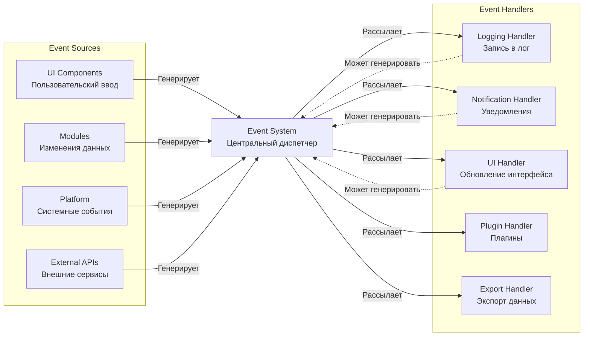
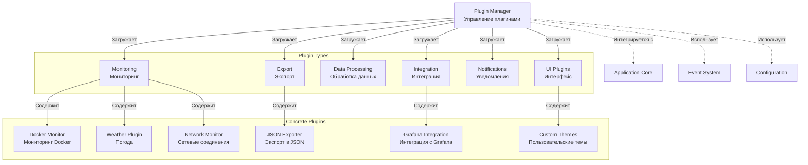
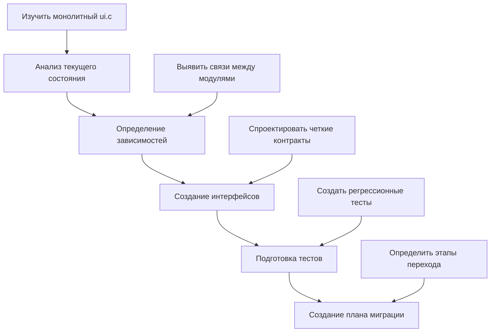
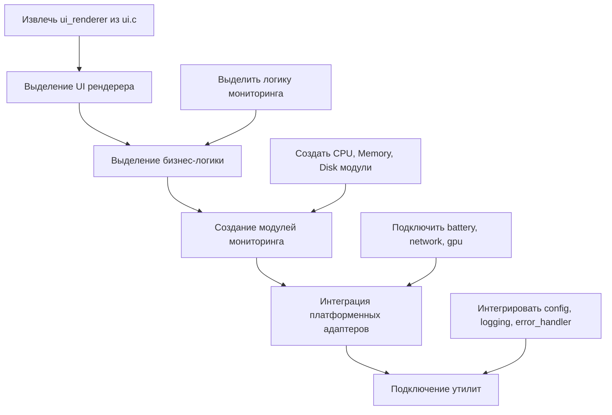
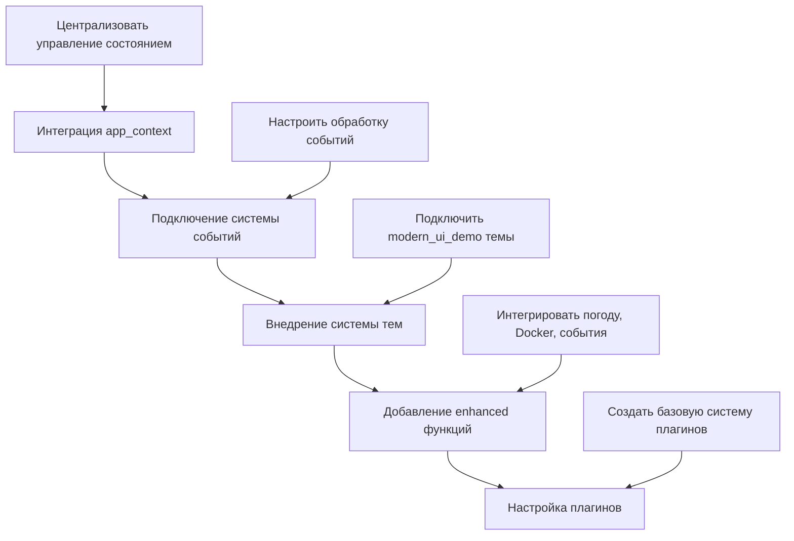
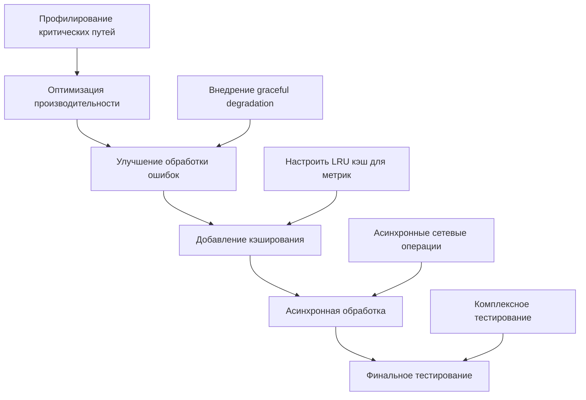

# Архитектура нового API SystemMonitor v3.0

## Обзор архитектуры

Новая архитектура SystemMonitor построена на принципах модульности, расширяемости и современном дизайне с использованием компонентов app_context, ui_renderer, enhanced.c и modern_ui_demo.

```
┌─────────────────────────────────────────────────────────────────────────┐
│                           SystemMonitor v3.0                           │
├─────────────────────────────────────────────────────────────────────────┤
│  ┌─────────────┐  ┌─────────────┐  ┌─────────────┐  ┌─────────────┐   │
│  │   Core      │  │  Modules    │  │  Platform   │  │   UI        │   │
│  │  Layer      │  │  Layer      │  │  Layer      │  │  Layer      │   │
│  │             │  │             │  │             │  │             │   │
│  │ • app_context│  • system_   │  • battery   │  • ui_renderer│   │
│  │ • app_events│    monitor   │  • disk      │  • ui_theme  │   │
│  │ • developer │  • grafana   │  • network   │  • ui_window_│   │
│  │ • process_  │  • prometheus│  • processes │    manager  │   │
│  │   tree      │  • diagnostics│  • gpu       │  • modern_ui │   │
│  │             │             │  • system_   │             │   │
│  │  Events &   │  Monitoring │    info     │  Theming &  │   │
│  │  Callbacks  │  & Metrics  │  • usb       │  Rendering  │   │
│  │             │             │  • smart    │             │   │
│  └─────────────┘  └─────────────┘  └─────────────┘  └─────────────┘   │
├─────────────────────────────────────────────────────────────────────────┤
│                          Plugin System                               │
├─────────────────────────────────────────────────────────────────────────┤
│  ┌─────────────┐  ┌─────────────┐  ┌─────────────┐  ┌─────────────┐   │
│  │ Monitoring  │  │  UI Plugins │  │ Data Export │  │ Integration │   │
│  │ Plugins     │  │             │  │ Plugins     │  │ Plugins     │   │
│  │             │  │             │  │             │  │             │   │
│  │ • Docker    │  │ • Custom    │  │ • JSON      │  • Grafana   │   │
│  │ • Weather   │  │   Widgets   │  │ • CSV       │  • Prometheus│   │
│  │ • Network   │  │ • Themes    │  │ • InfluxDB  │  • Custom    │   │
│  │ • Processes │  │ • Layouts   │  │ • Graphite  │    APIs     │   │
│  └─────────────┘  └─────────────┘  └─────────────┘  └─────────────┘   │
├─────────────────────────────────────────────────────────────────────────┤
│                        Enhanced Features                             │
├─────────────────────────────────────────────────────────────────────────┤
│  ┌─────────────┐  ┌─────────────┐  ┌─────────────┐  ┌─────────────┐   │
│  │ Weather API │  │Network Conn│  │System Events│  │ Quick Actions│   │
│  │             │  │ Monitoring  │  │             │  │              │   │
│  │ • OpenWeather│  │ • TCP/UDP   │  │ • Error     │  • Cache      │   │
│  │ • wttr.in   │  │ • Services  │  │   Tracking  │    Cleaner   │   │
│  │ • Auto-     │  │ • Ports     │  │ • Warning   │  • Memory     │   │
│  │   location  │  │ • Traffic   │  │   Monitor   │    Purge     │   │
│  └─────────────┘  └─────────────┘  └─────────────┘  └─────────────┘   │
└─────────────────────────────────────────────────────────────────────────┘
```

## Детальная архитектурная диаграмма

```mermaid
graph TB
    %% Главный слой приложения
    subgraph "Application Core"
        AC[app_context<br/>Центральное управление]
        AE[app_events<br/>Система событий]
        MM[Module Manager<br/>Управление модулями]
        MS[Metrics System<br/>Сбор метрик]
    end

    %% Слой модулей мониторинга
    subgraph "Monitoring Modules"
        SM[System Monitor<br/>Основной мониторинг]
        DT[Developer Tools<br/>Инструменты разработки]
        DG[Diagnostics<br/>Диагностика системы]
        GR[Grafana<br/>Экспорт в Grafana]
        PR[Prometheus<br/>Метрики Prometheus]
    end

    %% Слой платформенной абстракции
    subgraph "Platform Layer"
        BAT[Battery<br/>Батарея]
        DSK[Disk<br/>Дисковая система]
        NET[Network<br/>Сеть]
        PRC[Processes<br/>Процессы]
        GPU[GPU<br/>Графический процессор]
        SYS[System Info<br/>Информация о системе]
        USB[USB<br/>USB устройства]
        SMC[SMART<br/>SMART мониторинг]
    end

    %% Слой пользовательского интерфейса
    subgraph "UI Layer"
        UR[ui_renderer<br/>Рендерер]
        UT[ui_theme<br/>Система тем]
        UWM[ui_window_manager<br/>Управление окнами]
        MUD[modern_ui_demo<br/>Демо современного UI]
        UIV[ui_data_visualizer<br/>Визуализация данных]
        UIH[ui_input_handler<br/>Обработка ввода]
    end

    %% Утилиты и сервисы
    subgraph "Utilities & Services"
        CFG[Config Manager<br/>Управление конфигурацией]
        ENH[Enhanced Features<br/>Расширенные возможности]
        EH[Error Handler<br/>Обработка ошибок]
        LOG[Logging System<br/>Система логирования]
        PS[Plugin System<br/>Система плагинов]
    end

    %% Внешние интеграции
    subgraph "External Integrations"
        WTHR[Weather API<br/>Погода]
        NWCON[Network Connections<br/>Сетевые соединения]
        SYSEV[System Events<br/>Системные события]
        DOCKER[Docker Status<br/>Статус Docker]
        QA[Quick Actions<br/>Быстрые действия]
    end

    %% Связи между компонентами
    AC -.->|Управляет| MM
    AC -.->|События| AE
    AC -.->|Метрики| MS

    MM -.->|Загружает| SM
    MM -.->|Загружает| DT
    MM -.->|Загружает| DG
    MM -.->|Загружает| GR
    MM -.->|Загружает| PR

    SM -.->|Использует| BAT
    SM -.->|Использует| DSK
    SM -.->|Использует| NET
    SM -.->|Использует| PRC
    SM -.->|Использует| GPU
    SM -.->|Использует| SYS
    SM -.->|Использует| USB
    SM -.->|Использует| SMC

    UR -.->|Использует| UT
    UR -.->|Использует| MUD
    UIV -.->|Использует| UR
    UIH -.->|Управляет| UIV

    ENH -.->|Интегрирует| WTHR
    ENH -.->|Интегрирует| NWCON
    ENH -.->|Интегрирует| SYSEV
    ENH -.->|Интегрирует| DOCKER
    ENH -.->|Интегрирует| QA

    CFG -.->|Конфигурирует| AC
    CFG -.->|Конфигурирует| MM
    CFG -.->|Конфигурирует| UR

    EH -.->|Обрабатывает| AC
    EH -.->|Обрабатывает| SM
    EH -.->|Обрабатывает| ENH

    LOG -.->|Логирует| AC
    LOG -.->|Логирует| MM
    LOG -.->|Логирует| SM

    PS -.->|Расширяет| SM
    PS -.->|Расширяет| UR
    PS -.->|Расширяет| ENH

    %% Внешние зависимости
    subgraph "External Dependencies"
        NC[ncurses<br/>Библиотека UI]
        SYSCTL[sysctl<br/>Системные вызовы]
        PROC[libproc<br/>Информация о процессах]
        IOKIT[IOKit<br/>macOS hardware]
        UDEV[udev<br/>Linux hardware]
        CURL[curl<br/>HTTP запросы]
        JSON[json-c<br/>Парсинг JSON]
    end

    %% Связи с внешними зависимостями
    UR -.->|Использует| NC
    BAT -.->|Использует| IOKIT
    DSK -.->|Использует| SYSCTL
    PRC -.->|Использует| PROC
    NET -.->|Использует| SYSCTL
    GPU -.->|Использует| IOKIT
    USB -.->|Использует| IOKIT
    USB -.->|Использует| UDEV
    WTHR -.->|Использует| CURL
    ENH -.->|Использует| JSON
```



## Архитектура системы событий



## Архитектура системы плагинов



## Стратегия миграции к новому API

### Фаза 1: Подготовка (2 недели)



### Фаза 2: Модуляризация (4 недели)



### Фаза 3: Интеграция современных компонентов (3 недели)



### Фаза 4: Оптимизация и стабилизация (2 недели)



## Преимущества новой архитектуры

### 1. Модульность
- **До:** Монолитный `ui.c` (2200+ строк)
- **После:** Разделение на специализированные модули с четкими интерфейсами

### 2. Расширяемость
- **Плагины:** Легкое добавление новых функций
- **Темы:** Современная система тем в стиле btop
- **Интеграции:** Поддержка внешних сервисов

### 3. Надежность
- **Обработка ошибок:** Централизованная система с graceful degradation
- **События:** Асинхронная обработка событий между модулями
- **Логирование:** Структурированное логирование всех операций

### 4. Производительность
- **Асинхронность:** Неблокирующие операции
- **Кэширование:** Эффективное кэширование данных
- **Потоки:** Разделение на потоки для параллельной обработки

### 5. Современность
- **Компоненты:** Использование app_context, ui_renderer, enhanced.c
- **UI:** Современный дизайн в стиле btop с темами
- **API:** Четкие контракты между модулями

## Метрики успеха миграции

| Метрика | Текущее значение | Целевое значение | Приоритет |
|---------|------------------|------------------|-----------|
| Цикломатическая сложность основного модуля | 150+ | <50 | Высокий |
| Количество модулей | 8 | >15 | Средний |
| Покрытие тестами | ~30% | >80% | Высокий |
| Время компиляции | ~30 сек | <15 сек | Средний |
| Время запуска приложения | ~2 сек | <1 сек | Средний |
| Потребление памяти | ~50 MB | <30 MB | Низкий |

## Следующие шаги реализации

1. **Неделя 1-2:** Создать базовые интерфейсы модулей
2. **Неделя 3-4:** Реализовать систему событий
3. **Неделя 5-6:** Интегрировать современные темы
4. **Неделя 7-8:** Добавить enhanced функции
5. **Неделя 9-10:** Создать систему плагинов
6. **Неделя 11-12:** Тестирование и оптимизация

Эта архитектура обеспечит плавную миграцию от монолитного UI к современной модульной системе с сохранением всех существующих функций и добавлением новых возможностей.