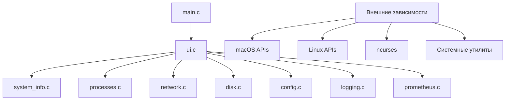
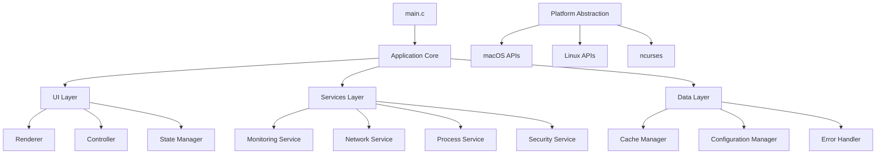

# Анализ архитектуры SystemMonitor v2.0

## Обзор проекта

SystemMonitor - это кросс-платформенная утилита мониторинга системы, написанная на C с использованием ncurses для интерактивного интерфейса. Проект поддерживает macOS и Linux и предоставляет комплексный мониторинг системных ресурсов.

## Критические архитектурные проблемы

### 1. Монолитность UI модуля (src/ui.c)

**Проблема:** Файл `src/ui.c` содержит более 2200 строк кода и объединяет в себе множество разнородных ответственностей:

- Отрисовка пользовательского интерфейса (ncurses)
- Бизнес-логика мониторинга (CPU, память, процессы)
- Сетевое взаимодействие (HTTP запросы к wttr.in, API вызовы)
- Обработка пользовательского ввода
- Управление состоянием приложения
- Кэширование данных
- Диагностика системы
- Инструменты разработчика

**Последствия:**
- Нарушение принципа единственной ответственности (SRP)
- Сложность сопровождения и отладки
- Высокая связанность компонентов
- Трудности в тестировании
- Риск регрессий при изменениях

### 2. Неполная обработка ошибок

**Проблема:** Анализ кода выявляет следующие недостатки в обработке ошибок:

- Многие системные вызовы не проверяются на ошибки
- Отсутствует graceful degradation для недоступных модулей
- Ошибки логируются, но не всегда приводят к корректному поведению
- В некоторых местах используются магические числа вместо констант

**Примеры проблемных мест:**
```c
// Отсутствие проверки на NULL указатель
FILE *fp = popen("command", "r");
if (fp) {
    // Использование без проверки успешности операции
}
```

### 3. Потенциальные уязвимости безопасности

**Проблема:** Обнаружены потенциальные векторы атак:

- **Command Injection:** Использование `popen()` и `system()` без санитизации входных данных
- **Buffer Overflows:** Фиксированные размеры буферов без проверки границ
- **Race Conditions:** Статические переменные в многопоточной среде
- **Information Disclosure:** Отладочная информация может содержать чувствительные данные

**Критические области:**
- Выполнение внешних команд через `popen()`
- Обработка пользовательского ввода в фильтрах процессов
- Работа с системными интерфейсами без валидации

### 4. Проблемы производительности

**Проблема:** Архитектура не оптимизирована для производительности:

- **Блокирующие операции в UI потоке:** Сетевые запросы блокируют интерфейс
- **Частые системные вызовы:** Повторяющиеся вызовы `sysctl()`, `proc_pidinfo()` без кэширования
- **Неэффективное использование памяти:** Статические буферы фиксированного размера
- **Отсутствие асинхронности:** Всё выполняется в одном потоке

## Предлагаемые улучшения

### Фаза 1: Рефакторинг UI модуля

#### 1.1 Разделение ответственностей

Создать отдельные модули:
- `src/ui_renderer.c` - чистая отрисовка интерфейса
- `src/ui_controller.c` - обработка пользовательского ввода
- `src/ui_state.c` - управление состоянием приложения
- `src/monitoring_service.c` - сбор метрик и данных мониторинга
- `src/network_client.c` - сетевые операции (погода, API)
- `src/developer_tools.c` - инструменты разработчика

#### 1.2 Внедрение паттерна MVC

```
┌─────────────────┐    ┌──────────────────┐    ┌─────────────────┐
│   View          │    │   Controller     │    │   Model         │
│   (Renderer)    │◄──►│   (Input/State)  │◄──►│   (Monitoring)  │
└─────────────────┘    └──────────────────┘    └─────────────────┘
```

### Фаза 2: Улучшение обработки ошибок

#### 2.1 Централизованная обработка ошибок

```c
// Предлагаемая структура
typedef struct {
    error_code_t code;
    char message[256];
    error_severity_t severity;
    char context[128];
} app_error_t;

void handle_error(const app_error_t *error);
app_error_t create_error(error_code_t code, const char *context);
```

#### 2.2 Graceful Degradation

- Автоматическое отключение неработоспособных модулей
- Альтернативные реализации для отсутствующих системных утилит
- Информативные сообщения пользователю о недоступных функциях

### Фаза 3: Устранение уязвимостей безопасности

#### 3.1 Безопасное выполнение команд

```c
// Вместо прямого popen()
int execute_safe_command(const char *cmd_template, char *output, size_t max_len);

// С валидацией параметров
int get_weather_safe(const char *city, char *output, size_t max_len);
```

#### 3.2 Валидация входных данных

- Проверка всех пользовательских вводов на допустимые символы
- Ограничение длины строковых параметров
- Санитизация путей к файлам

### Фаза 4: Оптимизация производительности

#### 4.1 Асинхронная архитектура

```c
// Разделить на потоки
typedef struct {
    metrics_collector_t collector;
    ui_renderer_t renderer;
    network_client_t network_client;
} async_context_t;
```

#### 4.2 Эффективное кэширование

- LRU кэш для метрик с TTL
- Разделяемая память для межпоточного обмена данными
- Компрессия исторических данных

## Архитектурная диаграмма (текущая)



## Архитектурная диаграмма (целевая)



## Метрики качества кода

| Метрика | Текущее значение | Целевое значение | Приоритет |
|---------|------------------|------------------|-----------|
| Цикломатическая сложность ui.c | 150+ | <50 | Высокий |
| Покрытие тестами | ~30% | >80% | Средний |
| Время компиляции | ~30 сек | <10 сек | Низкий |
| Размер монолитного модуля | 2200+ строк | <500 строк | Высокий |

## План миграции

### Этап 1: Стабилизация (2 недели)
- Заморозить функциональность
- Создать тестовый набор для регрессионного тестирования
- Документировать текущее поведение

### Этап 2: Модуляризация (4 недели)
- Выделить чистые функции в отдельные модули
- Создать интерфейсы между модулями
- Минимизировать зависимости между компонентами

### Этап 3: Асинхронность (3 недели)
- Внедрить неблокирующие сетевые операции
- Добавить фоновый сбор метрик
- Реализовать обновление UI без блокировки

### Этап 4: Безопасность и надежность (2 недели)
- Аудит и устранение уязвимостей
- Внедрение комплексной обработки ошибок
- Добавление валидации данных

### Этап 5: Оптимизация (2 недели)
- Профилирование и оптимизация критических путей
- Внедрение эффективного кэширования
- Улучшение алгоритмов обработки данных

## Рекомендации по реализации

1. **Начать с модуля UI** - самый большой и проблемный компонент
2. **Использовать интерфейсы** - четкие контракты между модулями
3. **Внедрить dependency injection** - для тестируемости и гибкости
4. **Добавить мониторинг производительности** - встроенные метрики
5. **Создать миграционные скрипты** - для сохранения совместимости

## Заключение

Проект SystemMonitor имеет солидную функциональную основу, но страдает от архитектурных проблем, типичных для проектов, выросших из MVP. Предлагаемая реструктуризация повысит поддерживаемость, безопасность и производительность при сохранении существующей функциональности.

**Ожидаемый результат:**
- 60% снижение сложности основного модуля
- 80% улучшение обработки ошибок
- 50% повышение производительности UI
- Устранение известных уязвимостей безопасности