# Спецификация структур данных нового API SystemMonitor v3.0

## Обзор структур данных

Структуры данных нового API обеспечивают стандартизированный обмен информацией между модулями, плагинами и внешними системами. Все структуры спроектированы с учетом производительности, расширяемости и безопасности.

## Иерархия структур данных

```mermaid
graph TD
    %% Базовые структуры
    Base[Базовые структуры данных]
    Base --> Metric[Структуры метрик]
    Base --> Event[Структуры событий]
    Base --> Config[Структуры конфигурации]

    %% Метрики
    Metric --> SysMetrics[Системные метрики]
    Metric --> ProcMetrics[Метрики процессов]
    Metric --> NetMetrics[Сетевые метрики]
    Metric --> DiskMetrics[Дисковые метрики]

    %% События
    Event --> ModEvents[События модулей]
    Event --> MonEvents[События мониторинга]
    Event --> UIEvents[События UI]
    Event --> ExtEvents[Внешние события]

    %% Конфигурация
    Config --> AppConfig[Конфигурация приложения]
    Config --> ModConfig[Конфигурация модулей]
    Config --> UIConfig[Конфигурация UI]
    Config --> PluginConfig[Конфигурация плагинов]

    %% Специализированные структуры
    Specialized[Специализированные структуры]
    Specialized --> Weather[Данные погоды]
    Specialized --> Docker[Данные Docker]
    Specialized --> Network[Сетевые соединения]
    Specialized --> Events[Системные события]
    Specialized --> Actions[Быстрые действия]
```



## 1. Базовые структуры данных

### 1.1 Структура метрики

```c
// src/core/data_structures/metric.h
#ifndef METRIC_H
#define METRIC_H

#include <stdint.h>
#include <time.h>

typedef enum {
    METRIC_TYPE_COUNTER = 1,          // Счетчик (монотонно возрастающий)
    METRIC_TYPE_GAUGE = 2,           // Измеритель (текущее значение)
    METRIC_TYPE_HISTOGRAM = 3,       // Гистограмма распределения
    METRIC_TYPE_TIMER = 4,           // Таймер (измерение времени)
    METRIC_TYPE_STRING = 5           // Строковое значение
} metric_type_t;

typedef enum {
    METRIC_UNIT_NONE = 0,            // Без единицы измерения
    METRIC_UNIT_PERCENT = 1,         // Проценты (%)
    METRIC_UNIT_BYTES = 2,           // Байты (B, KB, MB, GB)
    METRIC_UNIT_SECONDS = 3,         // Секунды (s, ms, us, ns)
    METRIC_UNIT_HERTZ = 4,           // Герцы (Hz, MHz, GHz)
    METRIC_UNIT_CELSIUS = 5,         // Градусы Цельсия (°C)
    METRIC_UNIT_VOLTS = 6,           // Вольты (V)
    METRIC_UNIT_AMPS = 7,            // Амперы (A)
    METRIC_UNIT_WATTS = 8,           // Ватты (W)
    METRIC_UNIT_BITS_PER_SEC = 9,    // Бит в секунду (bps, Mbps)
    METRIC_UNIT_PACKETS_PER_SEC = 10, // Пакетов в секунду
    METRIC_UNIT_COUNT = 11,          // Количество (count)
    METRIC_UNIT_RATIO = 12           // Соотношение (ratio)
} metric_unit_t;

typedef struct {
    char name[64];                   // Имя метрики
    char description[256];           // Описание метрики
    metric_type_t type;              // Тип метрики
    metric_unit_t unit;              // Единица измерения

    // Текущее значение
    union {
        double numeric_value;        // Числовое значение
        char string_value[128];      // Строковое значение
        struct {
            double sum;              // Сумма значений
            double count;            // Количество значений
            double min;              // Минимальное значение
            double max;              // Максимальное значение
            double mean;             // Среднее значение
            double stddev;           // Стандартное отклонение
        } histogram;
    } value;

    // Метаданные
    uint64_t timestamp;              // Временная метка (наносекунды)
    char source[64];                 // Источник метрики
    char tags[256];                  // Теги для категоризации (JSON формат)

    // Границы и пороги
    double warning_threshold;        // Порог предупреждения
    double critical_threshold;       // Критический порог
    double minimum_value;            // Минимальное значение
    double maximum_value;            // Максимальное значение

    // Статистика
    uint64_t collection_count;       // Количество сборов метрики
    uint64_t error_count;            // Количество ошибок сбора
    time_t first_collection;         // Время первого сбора
    time_t last_collection;          // Время последнего сбора

    // Флаги состояния
    bool is_valid;                   // Метрика валидна
    bool is_stale;                   // Метрика устарела
    bool is_error;                   // Ошибка при сборе метрики

} metric_t;

#endif // METRIC_H
```

### 1.2 Структура конфигурации

```c
// src/core/data_structures/config.h
#ifndef CONFIG_H
#define CONFIG_H

typedef enum {
    CONFIG_VALUE_INT = 1,
    CONFIG_VALUE_DOUBLE = 2,
    CONFIG_VALUE_STRING = 3,
    CONFIG_VALUE_BOOL = 4,
    CONFIG_VALUE_ARRAY = 5,
    CONFIG_VALUE_OBJECT = 6
} config_value_type_t;

typedef struct {
    char key[128];                   // Ключ конфигурации
    config_value_type_t type;        // Тип значения

    // Значение конфигурации
    union {
        int64_t int_value;
        double double_value;
        char string_value[256];
        bool bool_value;
        struct {
            void *data;              // Данные массива
            size_t count;            // Количество элементов
            size_t element_size;     // Размер элемента
        } array_value;
        struct {
            char *json_data;         // JSON объект
            size_t json_size;        // Размер JSON данных
        } object_value;
    } value;

    // Метаданные
    char description[256];           // Описание параметра
    char default_value[256];         // Значение по умолчанию
    char validation_regex[128];      // Регулярное выражение для валидации
    char allowed_values[512];        // Разрешенные значения (JSON массив)

    // Свойства
    bool required;                   // Обязательный параметр
    bool read_only;                  // Только для чтения
    bool sensitive;                  // Чувствительная информация (пароли и т.д.)
    bool restart_required;           // Требуется перезапуск приложения

    // Статистика
    time_t last_modified;            // Время последнего изменения
    char modified_by[64];            // Кто изменил параметр
    uint64_t change_count;           // Количество изменений

} config_entry_t;

typedef struct {
    char name[64];                   // Имя конфигурации
    char version[16];                // Версия схемы конфигурации
    char description[256];           // Описание конфигурации
    config_entry_t *entries;         // Массив параметров конфигурации
    int entry_count;                 // Количество параметров

    // Метаданные
    char file_path[256];             // Путь к файлу конфигурации
    time_t last_loaded;              // Время последней загрузки
    time_t last_saved;               // Время последнего сохранения
    bool auto_save;                  // Автосохранение изменений
    bool is_valid;                   // Конфигурация валидна

    // Статистика
    uint64_t load_count;             // Количество загрузок
    uint64_t save_count;             // Количество сохранений
    uint64_t validation_errors;      // Количество ошибок валидации

} config_t;

#endif // CONFIG_H
```

## 2. Структуры данных мониторинга

### 2.1 Системные метрики

```c
// src/modules/monitoring/system_metrics.h
#ifndef SYSTEM_METRICS_H
#define SYSTEM_METRICS_H

typedef struct {
    // CPU информация
    struct {
        int core_count;              // Количество ядер
        int thread_count;            // Количество потоков
        char model_name[128];        // Название модели процессора
        uint64_t frequency_mhz;      // Частота процессора (MHz)

        // Использование CPU
        double usage_percent;        // Общее использование (%)
        double *core_usage;          // Использование по ядрам (%)
        double user_percent;         // Пользовательское время (%)
        double system_percent;       // Системное время (%)
        double idle_percent;         // Время простоя (%)

        // Температура
        double temperature_celsius;  // Температура (°C)
        double *core_temperatures;   // Температура по ядрам (°C)

        // Загрузка системы
        double load_average_1m;      // Средняя загрузка за 1 минуту
        double load_average_5m;      // Средняя загрузка за 5 минут
        double load_average_15m;     // Средняя загрузка за 15 минут
    } cpu;

    // Память
    struct {
        uint64_t total_bytes;        // Общий объем памяти (байт)
        uint64_t used_bytes;         // Используемая память (байт)
        uint64_t free_bytes;         // Свободная память (байт)
        uint64_t cached_bytes;       // Кэшированная память (байт)
        uint64_t buffers_bytes;      // Буферы (байт)
        uint64_t available_bytes;    // Доступная память (байт)

        double usage_percent;        // Процент использования (%)

        // Swap пространство
        uint64_t swap_total_bytes;   // Общий объем swap (байт)
        uint64_t swap_used_bytes;    // Используемый swap (байт)
        uint64_t swap_free_bytes;    // Свободный swap (байт)

        // Детальная информация
        uint64_t active_bytes;       // Активная память (байт)
        uint64_t inactive_bytes;     // Неактивная память (байт)
        uint64_t wired_bytes;        // Зарезервированная память (байт)
    } memory;

    // Дисковая система
    struct {
        char device[64];             // Имя устройства
        char mount_point[256];       // Точка монтирования
        char filesystem[64];         // Тип файловой системы

        uint64_t total_bytes;        // Общий размер (байт)
        uint64_t used_bytes;         // Используемый размер (байт)
        uint64_t free_bytes;         // Свободный размер (байт)
        uint64_t available_bytes;    // Доступный размер (байт)

        double usage_percent;        // Процент использования (%)

        // Производительность
        uint64_t read_bytes_per_sec; // Скорость чтения (байт/сек)
        uint64_t write_bytes_per_sec;// Скорость записи (байт/сек)
        uint64_t read_operations_per_sec;  // Операций чтения в секунду
        uint64_t write_operations_per_sec; // Операций записи в секунду
    } disk;

    // Сеть
    struct {
        char interface_name[32];     // Имя сетевого интерфейса
        char ip_address[46];         // IP адрес (IPv4/IPv6)

        // Трафик
        uint64_t rx_bytes;           // Получено байт
        uint64_t tx_bytes;           // Отправлено байт
        uint64_t rx_packets;         // Получено пакетов
        uint64_t tx_packets;         // Отправлено пакетов
        uint64_t rx_errors;          // Ошибок получения
        uint64_t tx_errors;          // Ошибок отправки

        // Скорость
        uint64_t rx_bytes_per_sec;   // Скорость получения (байт/сек)
        uint64_t tx_bytes_per_sec;   // Скорость отправки (байт/сек)

        // Состояние
        bool is_up;                  // Интерфейс активен
        bool is_running;             // Интерфейс запущен
        int link_speed_mbps;         // Скорость соединения (Mbps)
    } network;

    // Процессы
    struct {
        int total_count;             // Общее количество процессов
        int running_count;           // Количество запущенных процессов
        int sleeping_count;          // Количество спящих процессов
        int zombie_count;            // Количество зомби процессов
        int thread_count;            // Общее количество потоков

        // Процессы по состоянию
        int user_processes;          // Пользовательские процессы
        int system_processes;        // Системные процессы
        int background_processes;    // Фоновые процессы

        // Топ процессы по CPU
        struct {
            int pid;
            char name[64];
            char user[32];
            double cpu_percent;
            uint64_t memory_bytes;
        } top_cpu_processes[10];

        // Топ процессы по памяти
        struct {
            int pid;
            char name[64];
            char user[32];
            double memory_percent;
            uint64_t memory_bytes;
        } top_memory_processes[10];
    } processes;

    // Время работы системы
    struct {
        time_t boot_time;            // Время загрузки системы
        time_t current_time;         // Текущее время
        uint64_t uptime_seconds;     // Время работы (секунды)

        // Время безотказной работы
        uint64_t uptime_days;        // Дней работы
        uint64_t uptime_hours;       // Часов работы
        uint64_t uptime_minutes;     // Минут работы
    } uptime;

} system_metrics_t;

#endif // SYSTEM_METRICS_H
```

### 2.2 Метрики процессов

```c
// src/modules/monitoring/process_metrics.h
#ifndef PROCESS_METRICS_H
#define PROCESS_METRICS_H

typedef enum {
    PROCESS_STATE_RUNNING = 'R',     // Выполняется
    PROCESS_STATE_SLEEPING = 'S',    // Спит (прерываемый сон)
    PROCESS_STATE_DISK_SLEEP = 'D',  // Спит (непрерываемый сон)
    PROCESS_STATE_ZOMBIE = 'Z',      // Зомби процесс
    PROCESS_STATE_STOPPED = 'T',     // Остановлен
    PROCESS_STATE_TRACING = 't',     // Трассируется
    PROCESS_STATE_DEAD = 'X',        // Умерший процесс
    PROCESS_STATE_IDLE = 'I'         // Простой (для ядер)
} process_state_t;

typedef struct {
    int pid;                         // PID процесса
    int ppid;                        // PID родительского процесса
    int pgid;                        // ID группы процессов
    int sid;                         // ID сессии

    // Информация о процессе
    char name[64];                   // Имя процесса
    char command[256];               // Команда запуска
    char user[32];                   // Пользователь
    char group[32];                  // Группа

    // Состояние процесса
    process_state_t state;           // Текущее состояние
    char state_char;                 // Символьное обозначение состояния
    int priority;                    // Приоритет процесса
    int nice_value;                  // Nice значение

    // Использование ресурсов
    double cpu_percent;              // Использование CPU (%)
    uint64_t memory_bytes;           // Используемая память (байт)
    double memory_percent;           // Процент памяти (%)
    uint64_t virtual_memory_bytes;   // Виртуальная память (байт)

    // Время выполнения
    uint64_t user_time_ms;           // Пользовательское время (мс)
    uint64_t system_time_ms;         // Системное время (мс)
    uint64_t total_time_ms;          // Общее время (мс)
    time_t start_time;               // Время запуска

    // Память и файлы
    uint64_t rss_bytes;              // Resident Set Size (байт)
    uint64_t shared_memory_bytes;    // Разделяемая память (байт)
    uint64_t data_memory_bytes;      // Память данных (байт)
    uint64_t stack_memory_bytes;     // Стек (байт)

    // Файловые дескрипторы
    int file_descriptors_count;      // Количество файловых дескрипторов
    uint64_t read_bytes;             // Прочитано байт
    uint64_t write_bytes;            // Записано байт

    // Сеть (если применимо)
    uint64_t socket_inodes[16];      // Иноды сокетов

    // Дополнительная информация
    char cwd[256];                   // Текущая рабочая директория
    char root[256];                  // Корневая директория
    char exe_path[512];              // Путь к исполняемому файлу

    // Флаги
    bool is_kernel_thread;           // Является ли процесс thread ядра
    bool is_thread;                  // Является ли процесс thread
    bool has_children;               // Есть ли дочерние процессы

} process_info_t;

#endif // PROCESS_METRICS_H
```

## 3. Структуры данных пользовательского интерфейса

### 3.1 Структура темы UI

```c
// src/ui/data_structures/theme.h
#ifndef THEME_H
#define THEME_H

typedef struct {
    char name[32];                   // Название темы
    char display_name[64];           // Отображаемое название
    char author[64];                 // Автор темы
    char version[16];                // Версия темы
    char description[256];           // Описание темы

    // Цветовая палитра
    struct {
        // Основные цвета
        uint32_t background;         // Фон
        uint32_t foreground;         // Основной текст
        uint32_t accent;             // Акцентный цвет
        uint32_t secondary;          // Вторичный цвет

        // Цвета состояний
        uint32_t success;            // Успех
        uint32_t warning;            // Предупреждение
        uint32_t error;              // Ошибка
        uint32_t info;               // Информация

        // Цвета метрик
        uint32_t cpu_low;            // Низкая нагрузка CPU
        uint32_t cpu_medium;         // Средняя нагрузка CPU
        uint32_t cpu_high;           // Высокая нагрузка CPU
        uint32_t cpu_critical;       // Критическая нагрузка CPU

        uint32_t memory_low;         // Низкое использование памяти
        uint32_t memory_medium;      // Среднее использование памяти
        uint32_t memory_high;        // Высокое использование памяти
        uint32_t memory_critical;    // Критическое использование памяти

        uint32_t disk_low;           // Низкое использование диска
        uint32_t disk_medium;        // Среднее использование диска
        uint32_t disk_high;          // Высокое использование диска
        uint32_t disk_critical;      // Критическое использование диска

        uint32_t network_low;        // Низкая активность сети
        uint32_t network_medium;     // Средняя активность сети
        uint32_t network_high;       // Высокая активность сети

        // Градиентные цвета для баров
        uint32_t gradient_start;     // Начало градиента
        uint32_t gradient_end;       // Конец градиента
        uint32_t gradient_middle;    // Середина градиента

    } colors;

    // Шрифтовые настройки
    struct {
        char font_family[64];        // Семейство шрифтов
        int font_size;               // Размер шрифта
        int font_size_small;         // Маленький размер шрифта
        int font_size_large;         // Большой размер шрифта

        bool bold_headers;           // Жирные заголовки
        bool italic_comments;        // Курсивные комментарии
        bool underline_links;        // Подчеркнутые ссылки

        uint32_t font_color;         // Цвет шрифта
        uint32_t font_color_secondary; // Вторичный цвет шрифта
    } fonts;

    // Параметры компоновки
    struct {
        int spacing;                 // Расстояние между элементами
        int padding;                 // Внутренние отступы
        int border_width;            // Ширина рамок
        int border_radius;           // Радиус скругления углов

        bool show_borders;           // Показывать рамки
        bool show_shadows;           // Показывать тени
        bool enable_animations;      // Включить анимации
        double animation_speed;      // Скорость анимации

        int bar_height;              // Высота прогресс-баров
        int bar_width;               // Ширина прогресс-баров
        int chart_height;            // Высота графиков
    } layout;

    // Анимации и эффекты
    struct {
        bool fade_in;                // Анимация появления
        bool slide_in;               // Анимация скольжения
        bool pulse;                  // Пульсирующая анимация

        int animation_duration_ms;   // Длительность анимации (мс)
        int animation_delay_ms;      // Задержка анимации (мс)

        // Эффекты для критических состояний
        bool blink_on_critical;      // Мигание при критических состояниях
        bool color_pulse_on_warning; // Цветовой пульс при предупреждениях
    } animations;

} ui_theme_t;

#endif // THEME_H
```

### 3.2 Структура виджета UI

```c
// src/ui/data_structures/widget.h
#ifndef WIDGET_H
#define WIDGET_H

typedef enum {
    WIDGET_TYPE_LABEL = 1,           // Текстовая метка
    WIDGET_TYPE_BAR = 2,             // Прогресс-бар
    WIDGET_TYPE_CHART = 3,           // График
    WIDGET_TYPE_SPARKLINE = 4,       // Спарклайн
    WIDGET_TYPE_ICON = 5,            // Иконка
    WIDGET_TYPE_BUTTON = 6,          // Кнопка
    WIDGET_TYPE_INPUT = 7,           // Поле ввода
    WIDGET_TYPE_LIST = 8,            // Список
    WIDGET_TYPE_TABLE = 9,           // Таблица
    WIDGET_TYPE_BOX = 10,            // Рамка
    WIDGET_TYPE_SEPARATOR = 11       // Разделитель
} widget_type_t;

typedef enum {
    WIDGET_POSITION_ABSOLUTE = 1,    // Абсолютное позиционирование
    WIDGET_POSITION_RELATIVE = 2,    // Относительное позиционирование
    WIDGET_POSITION_FLOAT = 3        // Плавающее позиционирование
} widget_position_type_t;

typedef struct {
    int x;                           // Координата X
    int y;                           // Координата Y
    int width;                       // Ширина виджета
    int height;                      // Высота виджета
    widget_position_type_t position_type; // Тип позиционирования
    char anchor[16];                 // Точка привязки (top-left, center, etc.)
} widget_position_t;

typedef struct {
    char id[64];                     // Уникальный идентификатор виджета
    char name[64];                   // Имя виджета
    widget_type_t type;              // Тип виджета

    // Позиция и размеры
    widget_position_t position;      // Позиция виджета
    bool auto_resize;                // Автоматическое изменение размера

    // Внешний вид
    char style_class[64];            // CSS класс стиля
    uint32_t background_color;       // Цвет фона
    uint32_t border_color;           // Цвет рамки
    int border_width;                // Ширина рамки

    // Данные виджета
    void *data;                      // Указатель на данные
    size_t data_size;                // Размер данных

    // Свойства отображения
    bool visible;                    // Виджет видим
    bool enabled;                    // Виджет активен
    double opacity;                  // Прозрачность (0.0 - 1.0)

    // Анимации
    bool animated;                   // Анимированный виджет
    char animation_type[32];         // Тип анимации

    // Коллбеки
    void (*on_click)(struct widget_t *widget);
    void (*on_hover)(struct widget_t *widget);
    void (*on_data_update)(struct widget_t *widget);
    void (*on_resize)(struct widget_t *widget);

    // Дочерние виджеты
    struct widget_t **children;      // Массив дочерних виджетов
    int children_count;              // Количество дочерних виджетов

    // Родительский виджет
    struct widget_t *parent;         // Родительский виджет

} widget_t;

#endif // WIDGET_H
```

## 4. Структуры данных внешних интеграций

### 4.1 Данные погоды

```c
// src/enhanced/data_structures/weather.h
#ifndef WEATHER_H
#define WEATHER_H

typedef enum {
    WEATHER_CONDITION_CLEAR = 1,     // Ясно
    WEATHER_CONDITION_PARTLY_CLOUDY = 2, // Переменная облачность
    WEATHER_CONDITION_CLOUDY = 3,    // Облачно
    WEATHER_CONDITION_OVERCAST = 4,  // Пасмурно
    WEATHER_CONDITION_RAIN = 5,      // Дождь
    WEATHER_CONDITION_DRIZZLE = 6,   // Морось
    WEATHER_CONDITION_SNOW = 7,      // Снег
    WEATHER_CONDITION_FOG = 8,       // Туман
    WEATHER_CONDITION_THUNDERSTORM = 9, // Гроза
    WEATHER_CONDITION_UNKNOWN = 10   // Неизвестно
} weather_condition_t;

typedef struct {
    char city[128];                  // Название города
    char country[64];                // Страна
    double latitude;                 // Широта
    double longitude;                // Долгота

    // Текущие условия
    double temperature_celsius;      // Температура (°C)
    double feels_like_celsius;       // Ощущается как (°C)
    int humidity_percent;            // Влажность (%)
    int pressure_hpa;                // Давление (hPa)
    double wind_speed_ms;            // Скорость ветра (м/с)
    int wind_direction_degrees;      // Направление ветра (градусы)
    weather_condition_t condition;   // Текущее состояние погоды

    // Описание погоды
    char condition_text[128];        // Текстовое описание
    char icon[16];                   // Иконка погоды

    // Дополнительная информация
    int visibility_km;               // Видимость (км)
    int uv_index;                    // UV индекс
    double dew_point_celsius;        // Точка росы (°C)

    // Время восхода/заката
    time_t sunrise;                  // Восход солнца
    time_t sunset;                   // Закат солнца
    int daylight_hours;              // Часов дневного света

    // Прогноз
    struct {
        double max_temp_celsius;     // Максимальная температура
        double min_temp_celsius;     // Минимальная температура
        weather_condition_t condition; // Состояние погоды
        char condition_text[128];    // Описание погоды
        time_t date;                 // Дата прогноза
    } forecast[7];                   // Прогноз на 7 дней

    // Метаданные
    time_t last_updated;             // Время последнего обновления
    char provider[64];               // Провайдер данных (OpenWeatherMap, etc.)
    bool is_valid;                   // Данные валидны

} weather_data_t;

#endif // WEATHER_H
```

### 4.2 Данные Docker

```c
// src/enhanced/data_structures/docker.h
#ifndef DOCKER_H
#define DOCKER_H

typedef enum {
    DOCKER_CONTAINER_RUNNING = 1,    // Запущен
    DOCKER_CONTAINER_STOPPED = 2,    // Остановлен
    DOCKER_CONTAINER_PAUSED = 3,     // Приостановлен
    DOCKER_CONTAINER_RESTARTING = 4, // Перезапускается
    DOCKER_CONTAINER_EXITED = 5,     // Завершен
    DOCKER_CONTAINER_DEAD = 6,       // Мертвый
    DOCKER_CONTAINER_CREATED = 7     // Создан
} docker_container_state_t;

typedef struct {
    char id[16];                     // ID контейнера (короткий)
    char full_id[64];                // Полный ID контейнера
    char name[64];                   // Имя контейнера
    char image[128];                 // Образ контейнера

    // Состояние
    docker_container_state_t state;  // Текущее состояние
    char status[128];                // Детальное описание состояния
    time_t started_at;               // Время запуска
    time_t finished_at;              // Время завершения

    // Использование ресурсов
    double cpu_percent;              // Использование CPU (%)
    uint64_t memory_bytes;           // Используемая память (байт)
    uint64_t memory_limit_bytes;     // Лимит памяти (байт)
    char memory_usage[32];           // Использование памяти (строка)

    // Сеть
    char ports[256];                 // Порты (строка)
    char networks[128];              // Сети

    // Дополнительная информация
    char command[256];               // Команда запуска
    char labels[512];                // Метки (JSON)

    // Мониторинг
    time_t created_at;               // Время создания
    char owner[64];                  // Владелец

} docker_container_t;

typedef struct {
    char id[16];                     // ID образа (короткий)
    char full_id[64];                // Полный ID образа
    char repository[128];            // Репозиторий
    char tag[64];                    // Тег

    // Размеры
    uint64_t size_bytes;             // Размер образа (байт)
    uint64_t virtual_size_bytes;     // Виртуальный размер (байт)

    // Метаданные
    time_t created_at;               // Время создания
    char author[64];                 // Автор

    // Статистика использования
    int containers_count;            // Количество контейнеров
    char os[32];                     // Операционная система
    char architecture[16];           // Архитектура

} docker_image_t;

typedef struct {
    // Общая информация
    char version[32];                // Версия Docker
    char api_version[16];            // Версия API
    char operating_system[64];       // Операционная система
    int containers_running;          // Запущенные контейнеры
    int containers_total;            // Всего контейнеров
    int images_count;                // Количество образов
    int volumes_count;               // Количество volumes
    int networks_count;              // Количество сетей

    // Ресурсы
    uint64_t memory_total_bytes;     // Общая память Docker (байт)
    uint64_t memory_used_bytes;      // Используемая память (байт)
    uint64_t cpu_total_shares;       // Общие CPU shares

    // Контейнеры
    docker_container_t *containers;  // Массив контейнеров
    int containers_array_size;       // Размер массива контейнеров

    // Образы
    docker_image_t *images;          // Массив образов
    int images_array_size;           // Размер массива образов

    // Время сбора данных
    time_t collected_at;             // Время сбора данных
    bool is_valid;                   // Данные валидны

} docker_status_t;

#endif // DOCKER_H
```

## 5. Структуры данных плагинов

### 5.1 Структура плагина

```c
// src/plugins/data_structures/plugin.h
#ifndef PLUGIN_H
#define PLUGIN_H

typedef enum {
    PLUGIN_STATUS_UNLOADED = 0,      // Не загружен
    PLUGIN_STATUS_LOADED = 1,        // Загружен
    PLUGIN_STATUS_INITIALIZED = 2,   // Инициализирован
    PLUGIN_STATUS_STARTED = 3,       // Запущен
    PLUGIN_STATUS_STOPPED = 4,       // Остановлен
    PLUGIN_STATUS_ERROR = 5,         // Ошибка
    PLUGIN_STATUS_UNLOADING = 6      // Выгружается
} plugin_status_t;

typedef struct {
    char id[64];                     // Уникальный идентификатор плагина
    char name[64];                   // Имя плагина
    char version[16];                // Версия плагина
    char description[256];           // Описание плагина

    // Метаданные
    char author[64];                 // Автор плагина
    char license[64];                // Лицензия
    char homepage[256];              // Домашняя страница
    char repository[256];            // Репозиторий

    // Классификация
    char category[64];               // Категория плагина
    char tags[256];                  // Теги (через запятую)
    int priority;                    // Приоритет загрузки

    // Зависимости
    char dependencies[512];          // Зависимости (JSON массив)
    char conflicts[256];             // Конфликты (JSON массив)
    char requirements[256];          // Требования (JSON объект)

    // Техническая информация
    char file_path[256];             // Путь к файлу плагина
    void *library_handle;            // Дескриптор динамической библиотеки
    time_t load_time;                // Время загрузки
    time_t last_used;                // Последнее использование

    // Состояние
    plugin_status_t status;          // Текущий статус
    char status_message[256];        // Сообщение о статусе
    int error_code;                  // Код последней ошибки

    // Статистика
    uint64_t call_count;             // Количество вызовов
    time_t total_execution_time_ms;  // Общее время выполнения (мс)
    uint64_t memory_usage_bytes;     // Использование памяти (байт)

    // Конфигурация
    config_t *config;                // Конфигурация плагина
    void *private_data;              // Приватные данные плагина

    // Интерфейс плагина
    struct {
        int (*init)(struct plugin_t *plugin);
        int (*start)(struct plugin_t *plugin);
        int (*stop)(struct plugin_t *plugin);
        int (*configure)(struct plugin_t *plugin, const config_t *config);
        int (*execute)(struct plugin_t *plugin, void *input, void *output);
        int (*cleanup)(struct plugin_t *plugin);
        const char *(*get_last_error)(struct plugin_t *plugin);
    } interface;

} plugin_t;

#endif // PLUGIN_H
```

## Заключение

Структуры данных нового API обеспечивают:

1. **Стандартизацию** обмена данными между модулями
2. **Расширяемость** через гибкие структуры с метаданными
3. **Производительность** через эффективное использование памяти
4. **Безопасность** через встроенные механизмы валидации
5. **Совместимость** с различными платформами и архитектурами

Эти структуры данных являются основой для надежного и эффективного взаимодействия всех компонентов SystemMonitor v3.0.