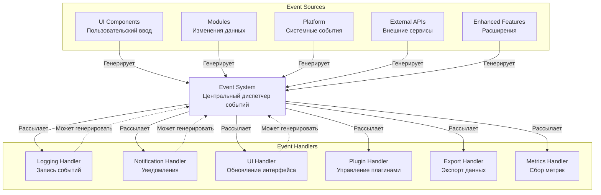

# Спецификация системы событий и коллбеков нового API

## Обзор системы событий

Система событий обеспечивает асинхронное взаимодействие между модулями нового API SystemMonitor, позволяя компонентам обмениваться данными и реагировать на изменения состояния без жестких зависимостей.

## Архитектура системы событий



## Типы событий

### 1. События жизненного цикла модулей

```c
// src/core/events/module_events.h
#ifndef MODULE_EVENTS_H
#define MODULE_EVENTS_H

typedef enum {
    // События инициализации модулей
    EVENT_MODULE_INITIALIZING = 1000,
    EVENT_MODULE_INITIALIZED,
    EVENT_MODULE_STARTING,
    EVENT_MODULE_STARTED,
    EVENT_MODULE_STOPPING,
    EVENT_MODULE_STOPPED,
    EVENT_MODULE_CLEANUP,

    // События ошибок модулей
    EVENT_MODULE_ERROR,
    EVENT_MODULE_WARNING,
    EVENT_MODULE_RECOVERED,

    // События обновления модулей
    EVENT_MODULE_UPDATED,
    EVENT_MODULE_CONFIG_CHANGED,
    EVENT_MODULE_STATE_CHANGED
} module_event_type_t;

typedef struct {
    char module_name[64];            // Имя модуля
    module_status_t status;          // Текущий статус модуля
    char error_message[256];         // Сообщение об ошибке (если есть)
    void *module_data;               // Дополнительные данные модуля
    size_t data_size;                // Размер дополнительных данных
} module_event_data_t;

#endif // MODULE_EVENTS_H
```

### 2. События данных мониторинга

```c
// src/core/events/monitoring_events.h
#ifndef MONITORING_EVENTS_H
#define MONITORING_EVENTS_H

typedef enum {
    // События мониторинга системы
    EVENT_CPU_DATA_UPDATED = 2000,
    EVENT_MEMORY_DATA_UPDATED,
    EVENT_DISK_DATA_UPDATED,
    EVENT_NETWORK_DATA_UPDATED,
    EVENT_PROCESS_DATA_UPDATED,
    EVENT_BATTERY_DATA_UPDATED,
    EVENT_GPU_DATA_UPDATED,
    EVENT_TEMPERATURE_UPDATED,

    // События производительности
    EVENT_PERFORMANCE_WARNING,
    EVENT_PERFORMANCE_CRITICAL,
    EVENT_PERFORMANCE_NORMAL,

    // События ресурсов
    EVENT_HIGH_MEMORY_USAGE,
    EVENT_HIGH_CPU_USAGE,
    EVENT_LOW_DISK_SPACE,
    EVENT_NETWORK_ISSUE
} monitoring_event_type_t;

typedef struct {
    metric_t *metrics;               // Массив метрик
    int metrics_count;               // Количество метрик
    char source[64];                 // Источник данных
    double threshold_value;          // Пороговое значение (если применимо)
    double current_value;            // Текущее значение
} monitoring_event_data_t;

#endif // MONITORING_EVENTS_H
```

### 3. События пользовательского интерфейса

```c
// src/core/events/ui_events.h
#ifndef UI_EVENTS_H
#define UI_EVENTS_H

typedef enum {
    // События ввода пользователя
    EVENT_KEY_PRESSED = 3000,
    EVENT_MOUSE_CLICKED,
    EVENT_WINDOW_RESIZED,
    EVENT_THEME_CHANGED,
    EVENT_UI_REFRESH_REQUESTED,

    // События отображения
    EVENT_UI_UPDATE_REQUIRED,
    EVENT_UI_REDRAW_COMPLETED,
    EVENT_UI_ERROR_DISPLAY,

    // События навигации
    EVENT_TAB_CHANGED,
    EVENT_PANEL_SWITCHED,
    EVENT_DIALOG_OPENED,
    EVENT_DIALOG_CLOSED
} ui_event_type_t;

typedef struct {
    int key_code;                    // Код клавиши (для событий клавиатуры)
    int mouse_x, mouse_y;            // Координаты мыши
    int window_width, window_height; // Размеры окна
    char theme_name[64];             // Имя темы (для событий смены темы)
    char panel_name[64];             // Имя панели (для событий навигации)
    void *ui_data;                   // Дополнительные данные UI
} ui_event_data_t;

#endif // UI_EVENTS_H
```

### 4. События внешних интеграций

```c
// src/core/events/external_events.h
#ifndef EXTERNAL_EVENTS_H
#define EXTERNAL_EVENTS_H

typedef enum {
    // События погоды
    EVENT_WEATHER_UPDATED = 4000,
    EVENT_WEATHER_ERROR,
    EVENT_WEATHER_API_LIMIT,

    // События сетевых соединений
    EVENT_NETWORK_CONNECTION_ESTABLISHED,
    EVENT_NETWORK_CONNECTION_LOST,
    EVENT_NETWORK_TRAFFIC_SPIKE,

    // События системных событий
    EVENT_SYSTEM_EVENT_DETECTED,
    EVENT_SYSTEM_ERROR_DETECTED,
    EVENT_SYSTEM_WARNING_DETECTED,

    // События Docker
    EVENT_DOCKER_CONTAINER_STARTED,
    EVENT_DOCKER_CONTAINER_STOPPED,
    EVENT_DOCKER_STATUS_CHANGED,

    // События быстрых действий
    EVENT_QUICK_ACTION_EXECUTED,
    EVENT_QUICK_ACTION_FAILED,
    EVENT_QUICK_ACTION_COMPLETED
} external_event_type_t;

typedef struct {
    char service_name[64];           // Имя сервиса (weather, docker, etc.)
    char event_description[256];     // Описание события
    void *service_data;              // Данные сервиса
    size_t data_size;                // Размер данных
    int status_code;                 // Код статуса (для API)
    char error_message[256];         // Сообщение об ошибке (если есть)
} external_event_data_t;

#endif // EXTERNAL_EVENTS_H
```

## Структура системы событий

### Основная структура системы событий

```c
// src/core/event_system.h
#ifndef EVENT_SYSTEM_H
#define EVENT_SYSTEM_H

#include <pthread.h>
#include <time.h>
#include "events/module_events.h"
#include "events/monitoring_events.h"
#include "events/ui_events.h"
#include "events/external_events.h"

// Максимальное количество обработчиков на событие
#define MAX_EVENT_HANDLERS 64

// Максимальный размер очереди событий
#define MAX_EVENT_QUEUE_SIZE 1024

typedef struct {
    event_type_t type;               // Тип события
    char source[64];                 // Источник события
    uint64_t timestamp;              // Временная метка (наносекунды)
    void *data;                      // Данные события
    size_t data_size;                // Размер данных
    int priority;                    // Приоритет события
    pthread_t source_thread;         // Поток-источник
} event_t;

typedef void (*event_callback_t)(const event_t *event, void *user_data);

typedef struct {
    event_callback_t callback;       // Функция обработчика
    void *user_data;                 // Пользовательские данные
    int priority;                    // Приоритет обработчика
    bool enabled;                    // Включен ли обработчик
    pthread_t handler_thread;        // Поток обработчика
} event_handler_t;

typedef struct {
    event_t *events[MAX_EVENT_QUEUE_SIZE]; // Очередь событий
    int head;                        // Начало очереди
    int tail;                        // Конец очереди
    int count;                       // Количество событий
    pthread_mutex_t mutex;           // Мьютекс для синхронизации
    pthread_cond_t not_empty;        // Условная переменная (очередь не пустая)
    pthread_cond_t not_full;         // Условная переменная (очередь не полная)
} event_queue_t;

typedef struct {
    // Информация о системе событий
    char version[16];                // Версия системы событий
    bool initialized;                // Инициализирована ли система
    int total_events_processed;      // Общее количество обработанных событий
    int active_handlers_count;       // Количество активных обработчиков

    // Очередь событий
    event_queue_t event_queue;       // Очередь событий

    // Обработчики событий
    event_handler_t handlers[MAX_EVENT_HANDLERS]; // Массив обработчиков

    // Поток обработки событий
    pthread_t event_thread;          // Поток обработки событий
    bool event_thread_running;       // Работает ли поток обработки

    // Статистика производительности
    struct {
        double average_processing_time_ms; // Среднее время обработки события
        int max_queue_size;              // Максимальный размер очереди
        int dropped_events_count;        // Количество потерянных событий
        time_t start_time;               // Время запуска системы
    } stats;

    // Мьютекс для синхронизации
    pthread_mutex_t mutex;
} event_system_t;

// Глобальная система событий
extern event_system_t *g_event_system;

// Функции инициализации и завершения
int event_system_init(void);
int event_system_cleanup(void);
int event_system_start(void);
int event_system_stop(void);

// Регистрация и удаление обработчиков
int event_register_handler(event_type_t event_type,
                          event_callback_t callback,
                          void *user_data,
                          int priority);

int event_unregister_handler(event_type_t event_type,
                            event_callback_t callback);

int event_enable_handler(event_type_t event_type,
                        event_callback_t callback,
                        bool enable);

// Отправка событий
int event_emit(event_type_t event_type,
               const char *source,
               void *data,
               size_t data_size);

int event_emit_with_priority(event_type_t event_type,
                            const char *source,
                            void *data,
                            size_t data_size,
                            int priority);

// Синхронная и асинхронная обработка
int event_process_sync(const event_t *event);
int event_process_async(const event_t *event);

// Управление очередью событий
int event_queue_size(void);
int event_clear_queue(void);
int event_get_queue_stats(int *size, int *capacity);

// Диагностика и мониторинг
int event_get_system_stats(char *buffer, size_t buffer_size);
int event_get_handler_stats(event_type_t event_type, char *buffer, size_t buffer_size);
const char *event_type_to_string(event_type_t event_type);

// Утилиты для работы с данными событий
int event_serialize(const event_t *event, char *buffer, size_t buffer_size);
int event_deserialize(const char *buffer, event_t *event);
int event_free_data(event_t *event);

#endif // EVENT_SYSTEM_H
```

## Реализация обработчиков событий

### Обработчик логирования

```c
// src/core/handlers/logging_handler.c
#ifndef LOGGING_HANDLER_H
#define LOGGING_HANDLER_H

typedef struct {
    char log_file_path[256];         // Путь к файлу лога
    int max_log_file_size_mb;        // Максимальный размер файла лога
    int max_log_files;               // Максимальное количество файлов логов
    log_level_t min_log_level;       // Минимальный уровень логирования
    bool log_to_console;             // Логировать в консоль
    bool log_to_file;                // Логировать в файл
    pthread_mutex_t mutex;           // Мьютекс для синхронизации
} logging_handler_config_t;

void logging_handler_callback(const event_t *event, void *user_data) {
    logging_handler_config_t *config = (logging_handler_config_t *)user_data;

    // Проверяем уровень логирования
    if (!should_log_event(event, config->min_log_level)) {
        return;
    }

    pthread_mutex_lock(&config->mutex);

    // Формируем сообщение лога
    char log_message[512];
    format_log_message(event, log_message, sizeof(log_message));

    // Записываем в файл (если включено)
    if (config->log_to_file) {
        log_to_file(config->log_file_path, log_message);
        rotate_log_files_if_needed(config);
    }

    // Выводим в консоль (если включено)
    if (config->log_to_console) {
        printf("%s\n", log_message);
    }

    pthread_mutex_unlock(&config->mutex);
}

#endif // LOGGING_HANDLER_H
```

### Обработчик уведомлений

```c
// src/core/handlers/notification_handler.c
#ifndef NOTIFICATION_HANDLER_H
#define NOTIFICATION_HANDLER_H

typedef enum {
    NOTIFICATION_INFO = 1,
    NOTIFICATION_WARNING = 2,
    NOTIFICATION_ERROR = 3,
    NOTIFICATION_CRITICAL = 4
} notification_priority_t;

typedef struct {
    bool notifications_enabled;      // Уведомления включены
    notification_priority_t min_priority; // Минимальный приоритет
    char notification_command[256];  // Команда для отправки уведомлений
    int notification_timeout_ms;     // Таймаут уведомления
    bool desktop_notifications;      // Десктопные уведомления
    bool sound_notifications;        // Звуковые уведомления
} notification_config_t;

void notification_handler_callback(const event_t *event, void *user_data) {
    notification_config_t *config = (notification_config_t *)user_data;

    // Проверяем приоритет события
    notification_priority_t priority = get_event_priority(event);
    if (priority < config->min_priority || !config->notifications_enabled) {
        return;
    }

    // Формируем текст уведомления
    char title[128];
    char message[512];
    format_notification_text(event, title, sizeof(title), message, sizeof(message));

    // Отправляем уведомление
    if (config->desktop_notifications) {
        send_desktop_notification(title, message, priority);
    }

    // Воспроизводим звук (если включено)
    if (config->sound_notifications) {
        play_notification_sound(priority);
    }

    // Выполняем пользовательскую команду (если задана)
    if (strlen(config->notification_command) > 0) {
        execute_notification_command(config->notification_command, title, message);
    }
}

#endif // NOTIFICATION_HANDLER_H
```

### Обработчик обновления UI

```c
// src/core/handlers/ui_handler.c
#ifndef UI_HANDLER_H
#define UI_HANDLER_H

typedef struct {
    ui_renderer_t *renderer;         // Рендерер пользовательского интерфейса
    ui_theme_t *current_theme;       // Текущая тема
    bool ui_refresh_enabled;         // Разрешено ли обновление UI
    int refresh_interval_ms;         // Интервал обновления (мс)
    pthread_mutex_t mutex;           // Мьютекс для синхронизации
    time_t last_refresh;             // Время последнего обновления
} ui_handler_config_t;

void ui_handler_callback(const event_t *event, void *user_data) {
    ui_handler_config_t *config = (ui_handler_config_t *)user_data;

    pthread_mutex_lock(&config->mutex);

    // Проверяем необходимость обновления
    time_t now = time(NULL);
    if (!config->ui_refresh_enabled ||
        (now - config->last_refresh) < (config->refresh_interval_ms / 1000)) {
        pthread_mutex_unlock(&config->mutex);
        return;
    }

    switch (event->type) {
        case EVENT_CPU_DATA_UPDATED:
        case EVENT_MEMORY_DATA_UPDATED:
        case EVENT_DISK_DATA_UPDATED:
            // Обновляем соответствующие виджеты
            update_monitoring_widgets(config->renderer, event);
            break;

        case EVENT_THEME_CHANGED:
            // Применяем новую тему
            apply_theme_change(config->renderer, config->current_theme, event);
            break;

        case EVENT_UI_REFRESH_REQUESTED:
            // Полное обновление интерфейса
            refresh_all_ui(config->renderer);
            break;

        default:
            // Обрабатываем другие типы событий UI
            handle_generic_ui_event(config->renderer, event);
            break;
    }

    config->last_refresh = now;
    pthread_mutex_unlock(&config->mutex);
}

#endif // UI_HANDLER_H
```

## Примеры использования системы событий

### Пример 1: Регистрация обработчика событий модуля

```c
// Регистрация обработчика для событий CPU мониторинга
int init_cpu_monitor_event_handler(void) {
    return event_register_handler(
        EVENT_CPU_DATA_UPDATED,
        cpu_data_updated_callback,
        NULL,  // пользовательские данные
        10     // приоритет
    );
}

void cpu_data_updated_callback(const event_t *event, void *user_data) {
    monitoring_event_data_t *data = (monitoring_event_data_t *)event->data;

    // Обрабатываем обновленные данные CPU
    for (int i = 0; i < data->metrics_count; i++) {
        metric_t *metric = &data->metrics[i];

        if (strcmp(metric->name, "cpu_usage") == 0) {
            // Обновляем индикатор CPU в UI
            update_cpu_indicator(metric->value);

            // Проверяем пороговые значения
            if (metric->value > 80.0) {
                // Генерируем событие предупреждения
                event_emit(EVENT_PERFORMANCE_WARNING,
                          "cpu_monitor",
                          &(warning_data_t){.type = WARNING_HIGH_CPU},
                          sizeof(warning_data_t));
            }
        }
    }
}
```

### Пример 2: Отправка события изменения темы

```c
// Смена темы пользовательского интерфейса
int change_ui_theme(const char *theme_name) {
    ui_theme_t *new_theme = load_theme(theme_name);
    if (!new_theme) {
        return -1;
    }

    // Применяем новую тему к рендереру
    int result = apply_theme_to_renderer(g_ui_renderer, new_theme);
    if (result != 0) {
        return -1;
    }

    // Отправляем событие смены темы
    theme_change_event_data_t theme_data = {
        .old_theme_name = g_current_theme->name,
        .new_theme_name = theme_name,
        .theme_object = new_theme
    };

    event_emit(EVENT_THEME_CHANGED,
               "ui_theme_manager",
               &theme_data,
               sizeof(theme_data));

    // Обновляем текущую тему
    g_current_theme = new_theme;

    return 0;
}
```

### Пример 3: Асинхронная обработка сетевых событий

```c
// Обработка событий погоды асинхронно
void weather_event_handler(const event_t *event, void *user_data) {
    weather_thread_context_t *ctx = (weather_thread_context_t *)user_data;

    switch (event->type) {
        case EVENT_WEATHER_UPDATED:
            // Обрабатываем обновленные данные погоды
            process_weather_update(ctx, event->data);
            break;

        case EVENT_WEATHER_ERROR:
            // Обрабатываем ошибку получения погоды
            handle_weather_error(ctx, event->data);

            // Планируем повторную попытку через 5 минут
            schedule_weather_retry(ctx, 300);
            break;

        case EVENT_WEATHER_API_LIMIT:
            // Достигнут лимит API
            handle_api_limit_exceeded(ctx, event->data);

            // Увеличиваем интервал опроса
            increase_weather_update_interval(ctx, 2.0); // Удваиваем интервал
            break;
    }
}
```

## Интеграция с app_context

### Расширение app_context для работы с событиями

```c
// Расширение структуры app_context_t
typedef struct {
    // ... существующие поля ...

    // Система событий
    event_system_t *event_system;

    // Обработчики событий приложения
    struct {
        void (*on_module_event)(const module_event_data_t *data);
        void (*on_monitoring_event)(const monitoring_event_data_t *data);
        void (*on_ui_event)(const ui_event_data_t *data);
        void (*on_external_event)(const external_event_data_t *data);
        void (*on_error_event)(const error_event_data_t *data);
    } event_handlers;

    // Статистика событий
    struct {
        uint64_t total_events_received;
        uint64_t total_events_processed;
        uint64_t events_per_second;
        time_t last_stats_update;
    } event_stats;

} app_context_extended_t;

// Инициализация системы событий в контексте приложения
int app_context_init_events(app_context_extended_t *ctx) {
    // Создаем систему событий
    ctx->event_system = create_event_system();
    if (!ctx->event_system) {
        return -1;
    }

    // Регистрируем обработчики событий приложения
    register_app_event_handlers(ctx);

    // Запускаем систему событий
    return event_system_start();
}

// Регистрация стандартных обработчиков событий приложения
void register_app_event_handlers(app_context_extended_t *ctx) {
    // Обработчик событий модулей
    event_register_handler(EVENT_MODULE_INITIALIZED,
                          module_initialized_handler,
                          ctx, 10);

    // Обработчик событий мониторинга
    event_register_handler(EVENT_CPU_DATA_UPDATED,
                          monitoring_data_handler,
                          ctx, 5);

    // Обработчик событий UI
    event_register_handler(EVENT_THEME_CHANGED,
                          ui_event_handler,
                          ctx, 8);

    // Обработчик внешних событий
    event_register_handler(EVENT_WEATHER_UPDATED,
                          external_event_handler,
                          ctx, 3);
}
```

## Заключение

Система событий и коллбеков обеспечивает:

1. **Асинхронное взаимодействие** между модулями
2. **Слабую связанность** компонентов системы
3. **Расширяемость** через регистрацию новых обработчиков
4. **Надежность** через обработку ошибок и приоритеты
5. **Производительность** через асинхронную обработку
6. **Мониторинг** через сбор статистики событий

Эта система является ключевым компонентом нового API, обеспечивающим эффективное взаимодействие между всеми модулями SystemMonitor v3.0.