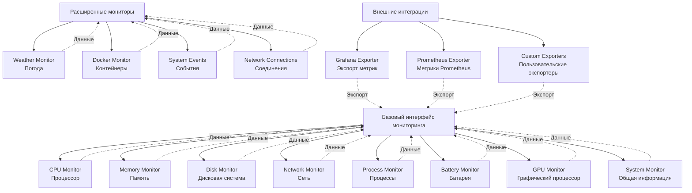

# Спецификация интерфейсов модулей мониторинга нового API

## Обзор интерфейсов мониторинга

Интерфейсы модулей мониторинга определяют контракты между подсистемами сбора данных и остальной частью приложения. Каждый модуль мониторинга реализует стандартизированный интерфейс для обеспечения взаимозаменяемости и легкости тестирования.

## Архитектура интерфейсов мониторинга



## 1. Базовый интерфейс мониторинга

### Структура базового монитора

```c
// src/modules/monitoring/monitor_interface.h
#ifndef MONITOR_INTERFACE_H
#define MONITOR_INTERFACE_H

#include "../core/module_interface.h"
#include "../core/data_structures/metric.h"
#include "../core/data_structures/config.h"

typedef enum {
    MONITOR_TYPE_SYSTEM = 1,         // Системный мониторинг
    MONITOR_TYPE_PROCESS = 2,        // Мониторинг процессов
    MONITOR_TYPE_NETWORK = 3,        // Сетевой мониторинг
    MONITOR_TYPE_STORAGE = 4,        // Мониторинг хранилища
    MONITOR_TYPE_EXTERNAL = 5,       // Внешний мониторинг
    MONITOR_TYPE_CUSTOM = 6          // Пользовательский мониторинг
} monitor_type_t;

typedef enum {
    MONITOR_FREQUENCY_HIGH = 1,      // Высокая частота (100мс)
    MONITOR_FREQUENCY_NORMAL = 2,    // Нормальная частота (1с)
    MONITOR_FREQUENCY_LOW = 3,       // Низкая частота (5с)
    MONITOR_FREQUENCY_CUSTOM = 4     // Пользовательская частота
} monitor_frequency_t;

typedef struct {
    // Идентификация монитора
    char id[64];                     // Уникальный идентификатор
    char name[64];                   // Имя монитора
    char description[256];           // Описание монитора
    monitor_type_t type;             // Тип монитора
    char version[16];                // Версия монитора

    // Конфигурация мониторинга
    monitor_frequency_t frequency;   // Частота сбора данных
    int custom_frequency_ms;         // Пользовательская частота (мс)
    bool enabled;                    // Монитор включен
    bool auto_start;                 // Автозапуск монитора

    // Пороговые значения
    double warning_threshold;        // Порог предупреждения
    double critical_threshold;       // Критический порог
    double min_value;                // Минимальное значение
    double max_value;                // Максимальное значение

    // Фильтры данных
    char *include_patterns;          // Шаблоны включения (regex)
    char *exclude_patterns;          // Шаблоны исключения (regex)
    int max_data_points;             // Максимум точек данных

    // Производительность
    struct {
        uint64_t total_collections;  // Общее количество сборов
        uint64_t successful_collections; // Успешных сборов
        uint64_t failed_collections; // Неудачных сборов
        double average_collection_time_ms; // Среднее время сбора (мс)
        time_t last_collection;      // Последний сбор данных
    } statistics;

} monitor_config_t;

typedef struct {
    // Базовый интерфейс модуля
    module_t base;

    // Специфичный интерфейс мониторинга
    struct {
        // Инициализация и управление
        int (*initialize)(monitor_config_t *config);
        int (*start_monitoring)(void);
        int (*stop_monitoring)(void);
        int (*pause_monitoring)(void);
        int (*resume_monitoring)(void);

        // Сбор данных
        int (*collect_data)(metric_t *metrics, int max_metrics);
        int (*get_current_values)(void *buffer, size_t buffer_size);
        int (*get_historical_data)(void *buffer, size_t buffer_size, time_t from, time_t to);

        // Конфигурация
        int (*update_config)(const monitor_config_t *new_config);
        int (*get_config)(monitor_config_t *config);
        int (*reset_config)(void);

        // Валидация данных
        int (*validate_data)(const void *data, size_t data_size);
        int (*get_data_quality)(double *quality_score);

        // Экспорт данных
        int (*export_data)(const char *format, const char *file_path);
        int (*stream_data)(void (*callback)(const metric_t *metric, void *user_data), void *user_data);

        // Диагностика
        int (*get_diagnostics)(char *buffer, size_t buffer_size);
        int (*run_self_test)(void);
        const char *(*get_last_error)(void);

        // Расширенные функции
        int (*set_alert_conditions)(const char *conditions_json);
        int (*get_alert_conditions)(char *buffer, size_t buffer_size);
        int (*enable_feature)(const char *feature_name, bool enable);

    } operations;

    // Внутренние данные монитора
    monitor_config_t config;         // Конфигурация монитора
    void *internal_data;             // Внутренние данные монитора

} monitor_t;

#endif // MONITOR_INTERFACE_H
```

## 2. Специализированные интерфейсы мониторинга

### 2.1 Интерфейс мониторинга CPU

```c
// src/modules/monitoring/cpu_monitor_interface.h
#ifndef CPU_MONITOR_INTERFACE_H
#define CPU_MONITOR_INTERFACE_H

typedef enum {
    CPU_MONITOR_FEATURE_BASIC = 1,   // Базовый мониторинг
    CPU_MONITOR_FEATURE_PER_CORE = 2, // Поядерный мониторинг
    CPU_MONITOR_FEATURE_TEMPERATURE = 3, // Мониторинг температуры
    CPU_MONITOR_FEATURE_FREQUENCY = 4, // Мониторинг частоты
    CPU_MONITOR_FEATURE_CACHE = 5,   // Мониторинг кэша
    CPU_MONITOR_FEATURE_LOAD_HISTORY = 6, // История нагрузки
    CPU_MONITOR_FEATURE_TOP_PROCESSES = 7 // Топ процессов по CPU
} cpu_monitor_feature_t;

typedef struct {
    // Структура данных CPU (см. system_metrics.h)
    struct {
        int core_count;
        int thread_count;
        char model_name[128];
        uint64_t frequency_mhz;
        double usage_percent;
        double *core_usage;
        double temperature_celsius;
        double *core_temperatures;
        double load_average_1m;
        double load_average_5m;
        double load_average_15m;
    } cpu_data;

    // Расширенная информация
    struct {
        uint64_t context_switches;   // Переключений контекста
        uint64_t interrupts;         // Прерываний
        uint64_t soft_interrupts;    // Программных прерываний
        double steal_time;           // Время кражи (для виртуализации)
        double guest_time;           // Время гостя (для виртуализации)
    } extended_data;

    // История нагрузки
    struct {
        double *hourly_history;      // История за час (3600 точек для 1с интервала)
        double *daily_history;       // История за день (1440 точек для 1мин интервала)
        double *weekly_history;      // История за неделю (168 точек для 1ч интервала)
        int current_hour_index;      // Текущий индекс в часовом массиве
        int current_day_index;       // Текущий индекс в дневном массиве
        int current_week_index;      // Текущий индекс в недельном массиве
    } history;

    // Топ процессы по CPU
    struct {
        process_info_t processes[10]; // Топ 10 процессов
        time_t last_update;          // Время последнего обновления
    } top_processes;

} cpu_monitor_data_t;

typedef struct {
    // Базовый интерфейс монитора
    monitor_t base;

    // Специфичные операции CPU мониторинга
    struct {
        // Получение данных CPU
        int (*get_cpu_info)(cpu_monitor_data_t *data);
        int (*get_core_info)(int core_id, double *usage, double *temperature);
        int (*get_cpu_usage_history)(double *buffer, int max_points, int time_range_hours);
        int (*get_top_cpu_processes)(process_info_t *processes, int max_count);

        // Управление мониторингом
        int (*set_core_monitoring)(int core_id, bool enabled);
        int (*set_temperature_monitoring)(bool enabled);
        int (*set_frequency_monitoring)(bool enabled);

        // Калибровка и настройка
        int (*calibrate_sensors)(void);
        int (*set_temperature_offsets)(const double *offsets, int core_count);
        int (*reset_calibration)(void);

        // Расширенный анализ
        int (*analyze_cpu_performance)(char *report, size_t report_size);
        int (*detect_cpu_bottlenecks)(char *bottlenecks, size_t buffer_size);
        int (*get_cpu_efficiency_score)(double *efficiency_score);

        // Предиктивный анализ
        int (*predict_cpu_usage)(int minutes_ahead, double *predicted_usage);
        int (*get_cpu_trends)(char *trends_json, size_t buffer_size);

    } cpu_operations;

} cpu_monitor_t;

#endif // CPU_MONITOR_INTERFACE_H
```

### 2.2 Интерфейс мониторинга памяти

```c
// src/modules/monitoring/memory_monitor_interface.h
#ifndef MEMORY_MONITOR_INTERFACE_H
#define MEMORY_MONITOR_INTERFACE_H

typedef enum {
    MEMORY_TYPE_PHYSICAL = 1,        // Физическая память
    MEMORY_TYPE_VIRTUAL = 2,         // Виртуальная память
    MEMORY_TYPE_SWAP = 3,            // Swap пространство
    MEMORY_TYPE_GPU = 4,             // Память GPU
    MEMORY_TYPE_CACHE = 5            // Кэш память
} memory_type_t;

typedef struct {
    // Структура данных памяти (см. system_metrics.h)
    struct {
        uint64_t total_bytes;
        uint64_t used_bytes;
        uint64_t free_bytes;
        uint64_t available_bytes;
        uint64_t cached_bytes;
        uint64_t buffers_bytes;
        double usage_percent;
    } memory_data;

    // Детальная информация по типам памяти
    struct {
        uint64_t anonymous_pages;    // Анонимные страницы
        uint64_t file_pages;         // Страницы файлов
        uint64_t dirty_pages;        // Грязные страницы
        uint64_t writeback_pages;    // Страницы в записи
        uint64_t mapped_pages;       // Отображенные страницы
        uint64_t shmem_pages;        // Shared memory страницы
        uint64_t slab_bytes;         // Slab память (байт)
    } detailed_info;

    // Swap информация
    struct {
        uint64_t total_bytes;
        uint64_t used_bytes;
        uint64_t free_bytes;
        double usage_percent;
        uint64_t swap_in_bytes_per_sec;  // Swap in скорость
        uint64_t swap_out_bytes_per_sec; // Swap out скорость
    } swap_data;

    // История использования памяти
    struct {
        double *memory_history;      // История использования памяти
        double *swap_history;        // История использования swap
        int history_size;            // Размер истории
        int current_index;           // Текущий индекс
        time_t last_update;          // Последнее обновление
    } history;

    // Анализ памяти
    struct {
        process_info_t top_memory_processes[10]; // Топ процессов по памяти
        uint64_t total_leaked_memory; // Объем утечек памяти
        int potential_leaks_count;   // Количество потенциальных утечек
        double fragmentation_ratio;  // Коэффициент фрагментации
    } analysis;

} memory_monitor_data_t;

typedef struct {
    // Базовый интерфейс монитора
    monitor_t base;

    // Специфичные операции мониторинга памяти
    struct {
        // Получение данных памяти
        int (*get_memory_info)(memory_monitor_data_t *data);
        int (*get_memory_usage_by_type)(memory_type_t type, uint64_t *used, uint64_t *total);
        int (*get_memory_history)(double *buffer, int max_points, int time_range_minutes);

        // Управление памятью
        int (*clear_page_cache)(void);
        int (*clear_dentrie_cache)(void);
        int (*compact_memory)(void);
        int (*set_swappiness)(int swappiness_value);

        // Анализ памяти
        int (*analyze_memory_usage)(char *report, size_t report_size);
        int (*detect_memory_leaks)(process_info_t *leaky_processes, int max_count);
        int (*get_memory_fragmentation)(double *fragmentation_ratio);
        int (*get_memory_pressure)(int *pressure_level);

        // Мониторинг процессов
        int (*get_process_memory_info)(int pid, uint64_t *rss, uint64_t *vsz, uint64_t *shared);
        int (*get_top_memory_processes)(process_info_t *processes, int max_count);
        int (*monitor_process_memory)(int pid, bool enable);

        // Предупреждения и алерты
        int (*set_memory_thresholds)(double warning_percent, double critical_percent);
        int (*get_memory_alerts)(char *alerts_json, size_t buffer_size);

        // Расширенные функции
        int (*enable_memory_profiling)(bool enable);
        int (*get_memory_profile)(char *profile_data, size_t buffer_size);
        int (*predict_memory_usage)(int minutes_ahead, uint64_t *predicted_usage);

    } memory_operations;

} memory_monitor_t;

#endif // MEMORY_MONITOR_INTERFACE_H
```

### 2.3 Интерфейс мониторинга процессов

```c
// src/modules/monitoring/process_monitor_interface.h
#ifndef PROCESS_MONITOR_INTERFACE_H
#define PROCESS_MONITOR_INTERFACE_H

typedef enum {
    PROCESS_SORT_BY_PID = 1,         // Сортировка по PID
    PROCESS_SORT_BY_CPU = 2,         // Сортировка по CPU
    PROCESS_SORT_BY_MEMORY = 3,      // Сортировка по памяти
    PROCESS_SORT_BY_NAME = 4,        // Сортировка по имени
    PROCESS_SORT_BY_USER = 5,        // Сортировка по пользователю
    PROCESS_SORT_BY_RUNTIME = 6      // Сортировка по времени выполнения
} process_sort_order_t;

typedef struct {
    // Фильтры процессов
    struct {
        char *name_pattern;          // Шаблон имени процесса
        char *user_pattern;          // Шаблон пользователя
        char *command_pattern;       // Шаблон команды
        process_state_t state;       // Фильтр по состоянию
        int min_cpu_percent;         // Минимальное использование CPU
        uint64_t min_memory_bytes;   // Минимальное использование памяти
        time_t min_runtime_seconds;  // Минимальное время выполнения
    } filters;

    // Настройки мониторинга
    struct {
        bool monitor_child_processes; // Мониторить дочерние процессы
        bool monitor_threads;        // Мониторить threads
        bool track_file_descriptors; // Отслеживать файловые дескрипторы
        bool track_network_connections; // Отслеживать сетевые соединения
        int max_processes_to_track;  // Максимум процессов для отслеживания
    } monitoring;

    // Статистика
    struct {
        int total_processes_found;   // Найдено процессов
        int filtered_processes;      // Отфильтровано процессов
        int zombie_processes;        // Зомби процессов
        int kernel_threads;          // Ядерных threads
    } stats;

} process_monitor_config_t;

typedef struct {
    // Базовый интерфейс монитора
    monitor_t base;

    // Специфичные операции мониторинга процессов
    struct {
        // Получение списка процессов
        int (*get_process_list)(process_info_t *processes, int max_count, process_sort_order_t sort_order);
        int (*get_process_info)(int pid, process_info_t *info);
        int (*get_process_tree)(int root_pid, process_info_t *tree, int max_depth);

        // Фильтрация процессов
        int (*set_process_filter)(const process_monitor_config_t *filter);
        int (*clear_process_filter)(void);
        int (*get_filtered_processes)(process_info_t *processes, int max_count);

        // Управление процессами
        int (*kill_process)(int pid, int signal);
        int (*renice_process)(int pid, int nice_value);
        int (*set_process_affinity)(int pid, const int *cpu_mask, int cpu_count);

        // Мониторинг процессов
        int (*start_process_monitoring)(int pid);
        int (*stop_process_monitoring)(int pid);
        int (*get_monitored_processes)(int *pids, int max_count);

        // Анализ процессов
        int (*analyze_process_behavior)(int pid, char *report, size_t report_size);
        int (*detect_anomalous_processes)(process_info_t *anomalies, int max_count);
        int (*get_process_relationships)(int pid, process_info_t *related, int max_count);

        // Статистика процессов
        int (*get_process_statistics)(char *statistics_json, size_t buffer_size);
        int (*get_system_load_sources)(process_info_t *heavy_processes, int max_count);

        // Поиск процессов
        int (*find_processes_by_name)(const char *pattern, process_info_t *processes, int max_count);
        int (*find_processes_by_port)(int port, process_info_t *processes, int max_count);
        int (*find_processes_by_file)(const char *file_path, process_info_t *processes, int max_count);

    } process_operations;

} process_monitor_t;

#endif // PROCESS_MONITOR_INTERFACE_H
```

### 2.4 Интерфейс сетевого мониторинга

```c
// src/modules/monitoring/network_monitor_interface.h
#ifndef NETWORK_MONITOR_INTERFACE_H
#define NETWORK_MONITOR_INTERFACE_H

typedef enum {
    NETWORK_TYPE_ETHERNET = 1,       // Ethernet
    NETWORK_TYPE_WIFI = 2,           // WiFi
    NETWORK_TYPE_CELLULAR = 3,       // Сотовая связь
    NETWORK_TYPE_VPN = 4,            // VPN
    NETWORK_TYPE_LOOPBACK = 5,       // Loopback
    NETWORK_TYPE_TUNNEL = 6          // Туннель
} network_type_t;

typedef struct {
    // Информация о сетевом интерфейсе
    struct {
        char name[32];               // Имя интерфейса
        char display_name[64];       // Отображаемое имя
        network_type_t type;         // Тип сети
        char mac_address[18];        // MAC адрес

        // Состояние интерфейса
        bool is_up;                  // Интерфейс активен
        bool is_running;             // Интерфейс запущен
        bool is_connected;           // Подключен к сети
        int link_speed_mbps;         // Скорость соединения

        // IP адреса
        char ipv4_address[16];       // IPv4 адрес
        char ipv6_address[46];       // IPv6 адрес
        char subnet_mask[16];        // Маска подсети
        char gateway[46];            // Шлюз

        // Статистика трафика
        uint64_t rx_bytes;           // Получено байт
        uint64_t tx_bytes;           // Отправлено байт
        uint64_t rx_packets;         // Получено пакетов
        uint64_t tx_packets;         // Отправлено пакетов
        uint64_t rx_errors;          // Ошибок получения
        uint64_t tx_errors;          // Ошибок отправки

        // Скорость передачи
        uint64_t rx_bytes_per_sec;   // Скорость получения
        uint64_t tx_bytes_per_sec;   // Скорость отправки
        double utilization_percent;  // Утилизация канала (%)

        // Качество соединения
        int signal_strength_percent; // Сила сигнала (%)
        int noise_level_db;          // Уровень шума (dB)
        int snr_db;                  // Отношение сигнал/шум (dB)

    } interface_info;

    // DNS информация
    struct {
        char primary_dns[46];        // Основной DNS сервер
        char secondary_dns[46];      // Вторичный DNS сервер
        char search_domains[256];    // Домены поиска
        int dns_resolution_time_ms;  // Время разрешения DNS (мс)
        bool dns_available;          // DNS доступен
    } dns_info;

    // Активные соединения
    struct {
        int tcp_connections;         // TCP соединений
        int udp_connections;         // UDP соединений
        int listening_ports;         // Прослушиваемых портов
        int established_connections; // Установленных соединений

        // Топ соединений по трафику
        struct {
            char local_addr[46];
            char remote_addr[46];
            int local_port;
            int remote_port;
            uint64_t bytes_transferred;
            char protocol[8];
        } top_connections[10];

    } connections;

    // Качество сети
    struct {
        double latency_ms;           // Задержка (мс)
        double jitter_ms;            // Джиттер (мс)
        int packet_loss_percent;     // Потеря пакетов (%)
        double bandwidth_mbps;       // Пропускная способность (Mbps)
        int mtu;                     // MTU размер
    } quality;

} network_monitor_data_t;

typedef struct {
    // Базовый интерфейс монитора
    monitor_t base;

    // Специфичные операции сетевого мониторинга
    struct {
        // Получение данных сети
        int (*get_network_info)(network_monitor_data_t *data);
        int (*get_interface_list)(network_interface_t *interfaces, int max_count);
        int (*get_interface_info)(const char *interface_name, network_interface_t *info);

        // Мониторинг трафика
        int (*get_traffic_history)(const char *interface_name, uint64_t *rx_history, uint64_t *tx_history, int max_points);
        int (*get_bandwidth_usage)(const char *interface_name, double *utilization_percent);
        int (*get_top_talkers)(network_connection_t *connections, int max_count);

        // Диагностика сети
        int (*ping_host)(const char *hostname, double *latency_ms);
        int (*traceroute)(const char *hostname, char *route_info, size_t buffer_size);
        int (*check_port_connectivity)(const char *host, int port, int *response_time_ms);

        // Управление сетью
        int (*set_interface_up)(const char *interface_name);
        int (*set_interface_down)(const char *interface_name);
        int (*restart_interface)(const char *interface_name);

        // DNS диагностика
        int (*resolve_hostname)(const char *hostname, char *ip_address, size_t address_size);
        int (*get_dns_info)(dns_info_t *dns_info);
        int (*flush_dns_cache)(void);

        // Анализ сети
        int (*analyze_network_performance)(char *report, size_t report_size);
        int (*detect_network_anomalies)(network_anomaly_t *anomalies, int max_count);
        int (*get_network_quality_score)(double *quality_score);

        // Безопасность сети
        int (*get_open_ports)(port_info_t *ports, int max_count);
        int (*detect_suspicious_connections)(connection_info_t *suspicious, int max_count);
        int (*analyze_network_security)(char *security_report, size_t buffer_size);

    } network_operations;

} network_monitor_t;

#endif // NETWORK_MONITOR_INTERFACE_H
```

## 3. Интерфейсы внешних интеграций

### 3.1 Интерфейс экспорта в Grafana

```c
// src/modules/export/grafana_interface.h
#ifndef GRAFANA_INTERFACE_H
#define GRAFANA_INTERFACE_H

typedef struct {
    char server_url[256];            // URL сервера Grafana
    char api_token[128];             // API токен
    char organization[64];           // Организация
    char default_dashboard[64];      // Дефолтный дашборд

    // Настройки экспорта
    struct {
        bool export_cpu_metrics;     // Экспортировать метрики CPU
        bool export_memory_metrics;  // Экспортировать метрики памяти
        bool export_disk_metrics;    // Экспортировать метрики диска
        bool export_network_metrics; // Экспортировать метрики сети
        bool export_process_metrics; // Экспортировать метрики процессов

        int export_interval_seconds; // Интервал экспорта (секунды)
        int batch_size;              // Размер батча
        bool enable_annotations;     // Включить аннотации
        bool enable_alerts;          // Включить алерты
    } export_settings;

    // Метрики для экспорта
    struct {
        char *cpu_metrics;           // Метрики CPU (JSON)
        char *memory_metrics;        // Метрики памяти (JSON)
        char *disk_metrics;          // Метрики диска (JSON)
        char *network_metrics;       // Метрики сети (JSON)
        char *custom_metrics;        // Пользовательские метрики (JSON)
    } metric_templates;

    // Статистика экспорта
    struct {
        uint64_t total_metrics_sent; // Всего отправлено метрик
        uint64_t total_errors;       // Количество ошибок
        time_t last_export;          // Последний экспорт
        double average_latency_ms;   // Средняя задержка (мс)
    } statistics;

} grafana_config_t;

typedef struct {
    // Базовый интерфейс монитора
    monitor_t base;

    // Специфичные операции Grafana экспорта
    struct {
        // Управление подключением
        int (*connect_to_grafana)(const grafana_config_t *config);
        int (*disconnect_from_grafana)(void);
        int (*test_connection)(void);

        // Управление дашбордами
        int (*create_dashboard)(const char *dashboard_json, char *dashboard_id, size_t id_size);
        int (*update_dashboard)(const char *dashboard_id, const char *dashboard_json);
        int (*delete_dashboard)(const char *dashboard_id);
        int (*get_dashboard_list)(char *dashboards_json, size_t buffer_size);

        // Экспорт метрик
        int (*export_metrics)(const metric_t *metrics, int metrics_count);
        int (*export_system_metrics)(const system_metrics_t *system_metrics);
        int (*export_batch_metrics)(const metric_t *metrics, int batch_size);

        // Управление аннотациями
        int (*add_annotation)(const char *dashboard_id, const annotation_t *annotation);
        int (*get_annotations)(const char *dashboard_id, time_t from, time_t to, char *annotations, size_t buffer_size);

        // Управление алертами
        int (*create_alert_rule)(const char *rule_json, char *rule_id, size_t id_size);
        int (*update_alert_rule)(const char *rule_id, const char *rule_json);
        int (*delete_alert_rule)(const char *rule_id);
        int (*get_alert_rules)(char *rules_json, size_t buffer_size);

        // Шаблоны метрик
        int (*load_metric_template)(const char *template_name);
        int (*save_metric_template)(const char *template_name, const char *template_json);
        int (*get_available_templates)(char *templates_json, size_t buffer_size);

        // Конфигурация
        int (*update_config)(const grafana_config_t *new_config);
        int (*get_config)(grafana_config_t *config);
        int (*validate_config)(const grafana_config_t *config);

    } grafana_operations;

} grafana_exporter_t;

#endif // GRAFANA_INTERFACE_H
```

## Заключение

Интерфейсы модулей мониторинга обеспечивают:

1. **Стандартизацию** взаимодействия между модулями сбора данных и остальной системой
2. **Расширяемость** через четкие контракты и возможность добавления новых операций
3. **Тестируемость** через разделение интерфейса и реализации
4. **Производительность** через оптимизированные структуры данных
5. **Надежность** через встроенные механизмы диагностики и валидации

Эти интерфейсы являются основой для создания надежной и масштабируемой системы мониторинга в SystemMonitor v3.0.