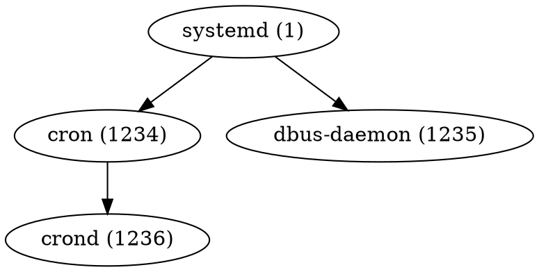

# 🌳 Руководство по использованию дерева процессов

## Обзор функционала

Новый модуль анализа дерева процессов предоставляет расширенные возможности для мониторинга и анализа системных процессов:

### Основные возможности
- **Построение иерархии процессов** с визуализацией родительских связей
- **Анализ зависимостей** между процессами и их ресурсами
- **Мониторинг ресурсов** по всему дереву процессов (наследование CPU/Memory)
- **Экспорт данных** в различные форматы для анализа
- **Интерактивная навигация** в терминальном интерфейсе

## Использование в терминальном интерфейсе

### Запуск основного монитора
```bash
./sysmon
```

### Доступ к дереву процессов
1. В основном интерфейсе нажмите `T` (Tree)
2. Система автоматически построит дерево процессов
3. Доступные действия:
   - `A` - ASCII визуализация дерева
   - `E` - Экспорт дерева в файл
   - `Q` - Возврат в основной интерфейс

## Программный интерфейс

### Основные структуры данных

```c
// Узел дерева процессов
typedef struct process_tree_node {
    pid_t pid, ppid;              // PID и родительский PID
    char name[256];               // Имя процесса
    float cpu_percent, memory_percent; // Использование ресурсов
    struct process_tree_node* parent;  // Родительский узел
    struct process_tree_node** children; // Массив дочерних узлов
    int children_count;           // Количество потомков
    int depth;                    // Глубина в дереве
    int tree_size;                // Размер всего поддерева
    float subtree_cpu, subtree_memory; // Суммарные ресурсы поддерева
} process_tree_node_t;

// Все дерево процессов
typedef struct {
    process_tree_node_t* root;    // Корневой узел (обычно init)
    process_tree_node_t** nodes;  // Массив всех узлов
    int node_count;               // Общее количество узлов
    unsigned long long timestamp; // Время построения дерева
} process_tree_t;
```

### Основные функции

```c
// Инициализация и построение дерева
int process_tree_init(process_tree_t* tree);
int process_tree_build(process_tree_t* tree);
void process_tree_destroy(process_tree_t* tree);

// Поиск процессов
process_tree_node_t* process_tree_find_by_pid(process_tree_t* tree, pid_t pid);
process_tree_node_t** process_tree_find_by_name(process_tree_t* tree, const char* pattern, int* count);

// Расчет статистики
void process_tree_calculate_subtree_stats(process_tree_node_t* node);
void process_tree_get_stats(process_tree_t* tree, process_group_stats_t* stats);

// Экспорт данных
int process_tree_export_txt(process_tree_t* tree, const char* filename);
int process_tree_export_json(process_tree_t* tree, const char* filename);
int process_tree_export_dot(process_tree_t* tree, const char* filename);

// Визуализация
void process_tree_draw_ascii(process_tree_t* tree, int max_depth);
```

## Примеры использования

### Пример 1: Построение и анализ дерева процессов

```c
#include "process_tree.h"

int main() {
    process_tree_t tree;

    // Инициализация
    process_tree_init(&tree);

    // Построение дерева
    if (process_tree_build(&tree) == 0) {
        printf("Дерево построено: %d процессов\n", tree.root->tree_size);

        // Анализ корневого процесса
        printf("Корень: %s (PID: %d)\n",
               tree.root->name, tree.root->pid);

        // Экспорт результатов
        process_tree_export_txt(&tree, "process_tree.txt");
        process_tree_export_json(&tree, "process_tree.json");
    }

    process_tree_destroy(&tree);
    return 0;
}
```

### Пример 2: Поиск процессов с высокой нагрузкой

```c
// Поиск процессов с CPU > 10%
process_tree_node_t** high_cpu_procs = process_tree_find_by_cpu(&tree, 10.0, &count);
for (int i = 0; i < count; i++) {
    printf("Процесс: %s (PID: %d) CPU: %.1f%%\n",
           high_cpu_procs[i]->name,
           high_cpu_procs[i]->pid,
           high_cpu_procs[i]->cpu_percent);
}
```

## Экспорт и визуализация

### Текстовый формат (TXT)
Содержит иерархическую структуру процессов с отступами:
```
Корневой процесс (PID: 1)
├── systemd (PID: 1234)
│   ├── cron (PID: 1235)
│   └── dbus-daemon (PID: 1236)
└── init (PID: 1237)
    └── bash (PID: 1238)
```

### JSON формат
Структурированные данные для программного анализа:
```json
{
    "timestamp": 1640995200,
    "root_process": {
        "pid": 1,
        "name": "systemd",
        "cpu_percent": 0.5,
        "memory_percent": 1.2,
        "children": [...]
    }
}
```

### Graphviz формат (DOT)
Для визуализации графа процессов:


## Визуализация графа

Для создания графического представления:

```bash
# Конвертация DOT в PNG
dot -Tpng process_tree.dot -o process_tree.png

# Конвертация в PDF
dot -Tpdf process_tree.dot -o process_tree.pdf

# Просмотр в интерактивном режиме
xdot process_tree.dot
```

## Производительность

### Оптимизация
- Дерево строится один раз при запуске
- Кэширование статистики процессов
- Эффективный поиск по индексам
- Ограничение глубины обхода для больших систем

### Рекомендации
- Для систем с большим количеством процессов используйте фильтры
- Ограничивайте глубину дерева для повышения производительности
- Используйте экспорт для детального анализа вместо интерактивного режима

## Интеграция с существующими инструментами

### Совместимость
- Работает с существующими модулями мониторинга
- Использует тот же формат данных для ресурсов
- Интегрируется с системой уведомлений
- Поддерживает экспорт в Prometheus

### Расширение функционала
Модуль легко расширяется для:
- Анализа сетевых соединений процессов
- Мониторинга файловой активности
- Отслеживания системных вызовов
- Анализа производительности по дереву процессов

## Диагностика проблем

### Распространенные проблемы
1. **Ошибка доступа к /proc** - проверьте права доступа
2. **Высокая нагрузка** - ограничьте глубину дерева
3. **Некорректные данные** - процесс может завершиться во время анализа

### Отладка
```bash
# Включить отладочный режим
SYSMON_DEBUG=1 ./sysmon

# Проверить доступность /proc
ls -la /proc/1/

# Тестирование модуля отдельно
gcc src/process_tree_demo.c src/process_tree.c -o demo && ./demo
```

## Заключение

Новый модуль анализа дерева процессов значительно расширяет возможности мониторинга системы, предоставляя глубокий анализ взаимосвязей между процессами и их влияния на системные ресурсы.